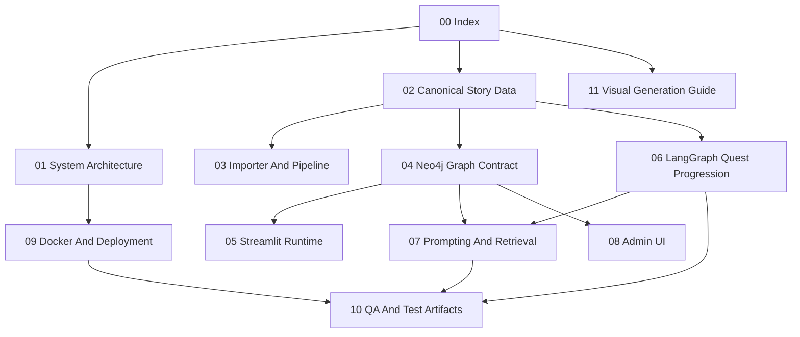

# NPC Persona v2 Presentation Source Index

이 폴더는 ChatGPT, 발표 자료 제작 도구, 혹은 시각화 모델에 전달하기 위한 **인수인계용 원천 문서 세트**다. 한 문서에 모든 내용을 넣으면 한 장의 이미지나 슬라이드에서 생략이 커지므로, 기능별로 문서를 나누었다.

> **역사적 발표 원천:** 이 문서 세트는 split 이전 monolith 구조와 당시 QA를 재현하기 위한 presentation source다. 아래 runtime, Compose, 파일 경로를 현재 production source-of-truth로 사용하지 않는다. 현재 기준은 [../../README.md](../../README.md)와 [../../system_architecture.md](../../system_architecture.md)를 따른다.

## 읽는 순서

| 순서 | 문서 | 목적 |
|---:|---|---|
| 1 | [01_system_architecture.md](01_system_architecture.md) | 전체 시스템 흐름을 먼저 잡는다. |
| 2 | [02_canonical_story_data.md](02_canonical_story_data.md) | 원천 스토리 데이터와 ID 계약을 이해한다. |
| 3 | [03_importer_and_pipeline.md](03_importer_and_pipeline.md) | 원천 데이터를 Neo4j와 생성 산출물로 바꾸는 두 경로를 구분한다. |
| 4 | [04_neo4j_graph_contract.md](04_neo4j_graph_contract.md) | 그래프 label, relationship, retrieval 속성을 이해한다. |
| 5 | [05_streamlit_runtime.md](05_streamlit_runtime.md) | 사용자가 채팅할 때 Streamlit runtime이 무엇을 하는지 본다. |
| 6 | [06_langgraph_quest_progression.md](06_langgraph_quest_progression.md) | LangGraph checkpoint와 퀘스트 진행 판정을 이해한다. |
| 7 | [07_prompting_and_retrieval.md](07_prompting_and_retrieval.md) | KnowledgeChunk 검색 gate와 prompt 조립 정책을 이해한다. |
| 8 | [08_admin_ui.md](08_admin_ui.md) | Admin 화면의 메모리/퀘스트/ConceptStory 관리 기능을 본다. |
| 9 | [09_docker_and_deployment.md](09_docker_and_deployment.md) | 운영 Compose와 design-test Compose를 구분한다. |
| 10 | [10_qa_and_test_artifacts.md](10_qa_and_test_artifacts.md) | QA 시나리오, 테스트, 산출물, 검증 근거를 확인한다. |
| 11 | [11_visual_generation_guide.md](11_visual_generation_guide.md) | Mermaid와 이미지 생성 prompt 사용 규칙을 확인한다. |

## 당시 발표 자료의 Source-of-truth 규칙

- canonical story source는 `rsc/data/`다.
- `output/`은 재생성 가능한 산출물이다. 보고서와 QA artifact는 증거로 읽되, 스토리 원천으로 편집하지 않는다.
- Runtime path는 `rsc/data -> Neo4j -> src/streamlit/test_app.py -> src/streamlit/prompting.py -> vLLM`이다.
- Offline artifact path는 `rsc/data -> scripts/story_pipeline/* -> output/integrated + output/neo4j_import`이다.
- Direct importer path는 `rsc/data -> src/db_control/import_story_source_to_neo4j.py -> Neo4j KnowledgeChunk graph`이다.

## 코드 전체 색인

| 영역 | 파일 | 책임 |
|---|---|---|
| Streamlit app | `src/streamlit/test_app.py` | 메인 채팅 UI, session state, Neo4j retrieval, prompt 조립, vLLM streaming, debug/log surface |
| Prompt | `src/streamlit/prompting.py` | NPC metadata, KnowledgeChunk, memory, quest guidance, final reveal policy를 하나의 prompt로 조립 |
| Chat log | `src/streamlit/chat_logging.py` | 사용자 입력과 NPC 출력만 담는 conversation-only JSONL record 생성 |
| Admin | `src/streamlit/pages/admin.py` | Memory Admin, Quest Admin, Concept Story Admin UI와 로그 |
| Quest types | `src/streamlit/quest_types.py` | NPC/Quest 상수, `QuestDecision`, `QuestGraphState`, TypedDict/dataclass 계약 |
| Quest loader | `src/streamlit/quest_loader.py` | `rsc/data` quest/clue/truth YAML을 runtime rule set으로 로드 |
| Quest rules | `src/streamlit/quest_rules.py` | 단서 매칭, quest state 전이, 로완 partial/final 판정, route 결정 |
| LangGraph graph | `src/streamlit/quest_graph.py` | `StateGraph(QuestGraphState)`와 `InMemorySaver` checkpoint 구성 |
| Quest runtime | `src/streamlit/quest_runtime.py` | `thread_id`, checkpoint merge, `graph.invoke`, decision map 적용 |
| Direct importer | `src/db_control/import_story_source_to_neo4j.py` | 원천 Markdown/YAML을 읽어 Neo4j node/relationship과 KnowledgeChunk로 MERGE |
| Offline coordinator | `scripts/story_pipeline/run_pipeline.py` | build -> validate -> export -> validate -> optional load 순서 실행 |
| Offline export | `scripts/story_pipeline/export_neo4j_import_files.py` | integrated JSON을 Neo4j CSV/Cypher import file로 변환 |
| Offline validation | `scripts/story_pipeline/validate_data.py` | integrated data의 quest/clue/truth/NPC reference 검증 |
| Docker default | `compose.yaml` | 운영/기본 로컬 compose, E4B model default, 8501/7474/7687/8000 local ports |
| Docker design-test | `compose.design-test.yaml` | 발표/검증용 isolated stack, E2B model default, 18501/17474/17687/18000 local ports |
| QA scenario | `test_script/run_quest_scenario_quality.py` | live Neo4j + E2B vLLM 기반 11-turn natural QA와 report/json 생성 |
| Quest tests | `test_script/test_quest_auto_progression.py` | quest state, LangGraph checkpoint continuity/isolation, admin source contract |
| Conversation tests | `test_script/test_quest_conversation_contract.py` | multi-quest route, Rowan partial/final guidance, chat log contract |
| Prompt tests | `test_script/test_streamlit_prompting.py` | prompt policy, final reveal instruction, memory formatting contract |
| Streamlit contract | `test_script/test_streamlit_contract.py` | retrieval gate, Admin surface, logging contract |

## 발표 이미지 제작용 전체 지도



Image-generation prompt:

```text
Create a clean technical roadmap image showing eleven Markdown source documents for the Hazel Village GraphRAG handoff. Use a top-down dependency map. Emphasize that canonical data flows into import/graph/runtime, while QA and deployment validate the full system. Keep labels exactly as the Mermaid nodes.
```

## 완료 기준 체크리스트

- [x] 전체 아키텍처가 문서화되어 있다.
- [x] canonical data와 generated output의 차이를 설명한다.
- [x] direct importer와 offline pipeline을 분리한다.
- [x] Neo4j graph label/relationship/retrieval property를 설명한다.
- [x] Streamlit chat runtime과 Admin runtime을 분리한다.
- [x] LangGraph checkpoint와 quest state machine을 설명한다.
- [x] prompt/retrieval/final reveal gate를 설명한다.
- [x] Docker default/design-test 환경을 구분한다.
- [x] QA artifact와 test command를 추적 가능하게 한다.
- [x] 모든 문서가 Mermaid diagram과 이미지 생성 prompt를 포함한다.
