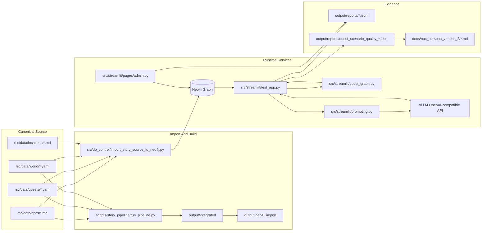
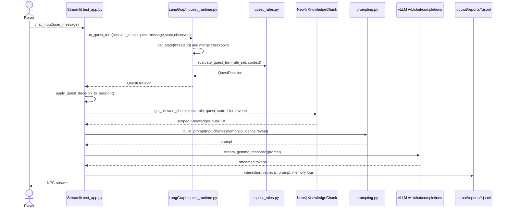

# 01. System Architecture

## 한 줄 요약

Hazel Village NPC Persona v2는 `rsc/data`의 NPC/Quest/World 원천 데이터를 Neo4j `KnowledgeChunk` 그래프로 적재하고, Streamlit 채팅 UI가 현재 NPC, player role, quest state, hint level에 맞는 chunk만 검색해 vLLM OpenAI-compatible endpoint로 보내는 GraphRAG MVP다.

## 전체 컴포넌트 도식



Image-generation prompt:

```text
Create an architecture diagram for Hazel Village GraphRAG. Show canonical story files on the left, import/build paths in the middle, Neo4j/Streamlit/LangGraph/prompting/vLLM runtime on the right, and QA/report evidence at the bottom. Use distinct colors for Source, Import, Runtime, and Evidence.
```

## Runtime sequence: 사용자가 NPC에게 질문할 때



Image-generation prompt:

```text
Generate a sequence diagram image of one NPC chat turn. Highlight the order: user message, LangGraph quest decision, Neo4j chunk retrieval, prompt assembly, vLLM streaming answer, and JSONL logging. Make the quest decision and answer-sensitive retrieval gate visually prominent.
```

## 핵심 코드 스니펫: 채팅 턴의 중심부

File: `src/streamlit/test_app.py`  
Purpose: 사용자 입력 하나를 받아 quest decision, retrieval, prompt, model response로 이어준다.  
Inputs: `user_message`, `st.session_state.npc_id`, `quest_id`, `quest_state_by_quest`, `quest_observed_clue_ids_by_quest`  
Outputs: Streamlit message, session state update, JSONL logs  
Invariant: `QuestDecision`이 먼저 적용된 뒤, 그 state/hint/reveal 권한으로 chunk를 검색해야 한다.

```python
quest_decision = run_quest_turn(
    session_id=st.session_state.quest_thread_session_id,
    npc_id=st.session_state.npc_id,
    quest_id=st.session_state.quest_id,
    user_message=user_message,
    quest_state_by_quest=st.session_state.quest_state_by_quest,
    observed_clue_ids_by_quest=st.session_state.quest_observed_clue_ids_by_quest,
)
apply_quest_decision_to_session(quest_decision)
answer_reveal_allowed = bool(quest_decision.reveal_truth_ids) or (
    st.session_state.npc_id == CHIEF_NPC_ID
    and st.session_state.quest_state == "solved"
)
chunks = get_allowed_chunks(
    npc_id=st.session_state.npc_id,
    player_role=st.session_state.player_role,
    quest_id=st.session_state.quest_id,
    quest_state=st.session_state.quest_state,
    allowed_hint_level=st.session_state.allowed_hint_level,
    answer_reveal_allowed=answer_reveal_allowed,
    limit=8,
)
prompt = build_prompt(
    npc=npc,
    chunks=chunks,
    user_message=user_message,
    quest_state=st.session_state.quest_state,
    player_role=st.session_state.player_role,
    allowed_hint_level=st.session_state.allowed_hint_level,
    conversation_context=get_npc_memory_context(st.session_state.npc_id),
    quest_guidance=quest_decision.guidance,
    answer_reveal_allowed=answer_reveal_allowed,
)
```

## 기능별 책임 분해

| 기능 | 담당 파일 | 핵심 책임 |
|---|---|---|
| NPC 선택 | `test_app.py` | NPC 선택 시 role/quest metadata 동기화 |
| Quest 자동 진행 | `quest_runtime.py`, `quest_graph.py`, `quest_rules.py` | 사용자 질의를 단서와 대조하고 `QuestDecision` 생성 |
| GraphRAG retrieval | `test_app.py#get_allowed_chunks` | NPC, quest, role, hint, answer-sensitive gate 적용 |
| Prompt 조립 | `prompting.py#build_prompt` | NPC 말투, 지식, memory, quest guidance, final reveal 정책 통합 |
| LLM 호출 | `test_app.py#stream_gemma_response` | OpenAI-compatible streaming response 처리 |
| Admin | `pages/admin.py` | memory, quest state, ConceptStory 관리 |
| Evidence | `chat_logging.py`, `append_feature_log` | 대화, retrieval, prompt, memory, admin, import 이벤트 저장 |

## 인수인계 메모

- 이 시스템은 LangGraph를 “LLM agent orchestration”보다 “quest state checkpoint runner”로 사용한다.
- 최종 전말 공개는 Neo4j retrieval gate와 prompt policy, quest rule이 함께 막는다.
- 운영 기본 compose는 E4B, design-test compose는 E2B다. 검증 문서에서 두 환경을 섞으면 안 된다.
