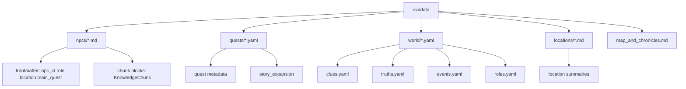
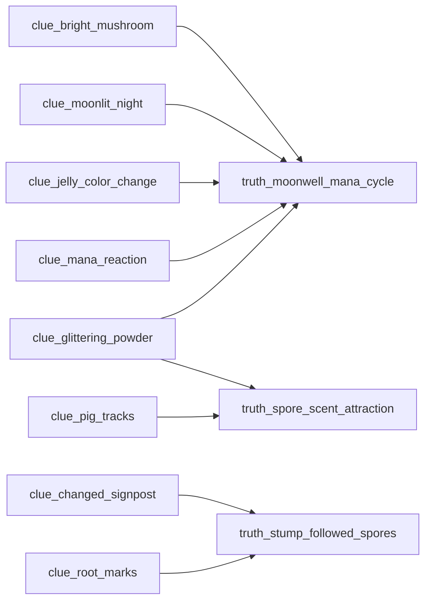

# 02. Canonical Story Data

## 한 줄 요약

`rsc/data/`가 헤이즐 마을 스토리의 canonical source다. NPC Markdown은 retrieval용 `KnowledgeChunk` 원천이고, Quest YAML은 진행 규칙과 final reveal policy 원천이며, World YAML은 role/event/clue/truth ID 계약을 제공한다.

## 데이터 소스 구조



Image-generation prompt:

```text
Draw the canonical story data folder as a tree. Emphasize that NPC Markdown produces KnowledgeChunk blocks, Quest YAML produces quest progression rules, and World YAML produces shared clue/truth/event/role IDs. Add a red note: output/ is generated, not canonical.
```

## 현재 데이터 규모

| 종류 | 개수/ID |
|---|---|
| NPC | `minmin_lady`, `patrol_leader_rio`, `mage_lumi`, `chief_rowan` |
| Quest | `q_glowing_mushroom`, `q_pig_escape`, `q_jelly_color`, `q_changed_signpost`, `q_main_spore_night` |
| Clue | 8개: 버섯, 달밤, 발자국, 가루, 젤리 색, 표지판, 뿌리 자국, 마나 반응 |
| Truth | 3개: 마나 주기 강화, 포자 냄새 유인, 꼬마그루터기 표지판 변화 |
| KnowledgeChunk | 30개: Rowan 8, Lumi 6, Minmin 9, Rio 7 |

## NPC Markdown 계약

NPC 파일은 YAML frontmatter와 여러 `chunk` fenced block으로 구성된다. Frontmatter는 NPC profile로, chunk block은 Neo4j `KnowledgeChunk`로 들어간다.

File: `rsc/data/npcs/chief_rowan.md`  
Purpose: 로완 NPC profile과 final reveal용 answer-sensitive 지식 제공  
Inputs: Markdown frontmatter, chunk metadata, chunk body  
Outputs: `NPC` node, `KnowledgeChunk` node, `NPC-[:KNOWS]->KnowledgeChunk`  
Invariant: `answer_sensitive: true` chunk는 hint level 3이어야 하고, final reveal gate 전에는 검색되면 안 된다.

```yaml
npc_id: chief_rowan
name: 헤이즐 촌장 로완
role: lord
location_id: hazel_square
main_quest: q_main_spore_night
knowledge_scope:
- village_report
- confidential_history
- confidential_truth
- overall_case_structure
```

```yaml
chunk_id: rowan_chronicle_001
npc_id: chief_rowan
title: 로완의 기록관 시절
allowed_roles:
- lord
knowledge_type: confidential_history
quest_id: null
answer_sensitive: true
hint_level: 3
clue_ids:
- clue_mana_reaction
- clue_moonlit_night
```

## Quest YAML 계약

Quest YAML은 quest state와 진행 단서, final answer truth, story expansion을 정의한다.

File: `rsc/data/quests/q_main_spore_night.yaml`  
Purpose: 로완 최종 종합 퀘스트와 final reveal policy  
Inputs: required clues, optional clues, answer truth, story expansion  
Outputs: `QuestRule`, `QuestStep`, `AnswerRevealPolicy`  
Invariant: 로완만 final truth를 공개할 수 있고, 필수 단서가 모이기 전에는 answer-sensitive chunk를 열지 않는다.

```yaml
quest_id: q_main_spore_night
title: 포자의 밤
quest_type: main_inference
involved_npc_ids:
- minmin_lady
- patrol_leader_rio
- mage_lumi
- chief_rowan
required_clue_ids:
- clue_bright_mushroom
- clue_pig_tracks
- clue_jelly_color_change
- clue_changed_signpost
- clue_glittering_powder
answer_truth_ids:
- truth_moonwell_mana_cycle
```

```yaml
answer_reveal_policy:
  can_reveal_truth_before_required_clues: false
  required_before_reveal:
  - clue_bright_mushroom
  - clue_pig_tracks
  - clue_jelly_color_change
  - clue_changed_signpost
  - clue_glittering_powder
  npc_allowed_to_reveal:
  - chief_rowan
  npc_not_allowed_to_reveal:
  - minmin_lady
  - patrol_leader_rio
  - mage_lumi
```

## Clue/Truth 연결



Image-generation prompt:

```text
Create a clue-to-truth dependency graph for Hazel Village. Show eight clue nodes feeding three truth nodes. Make truth_moonwell_mana_cycle central and highlight that Rowan can reveal it only after required quest progression.
```

## Story expansion의 역할

`story_expansion`은 presentation/story only 필드가 아니라 runtime rule loader의 입력이다. 특히 다음 하위 필드가 중요하다.

| 필드 | 쓰임 |
|---|---|
| `quest_steps` | 사용자 발화와 대조할 단계별 관찰/힌트/해금 단서 |
| `unlocked_clue_ids` | 단계 충족 시 `observed_clue_ids`에 추가할 clue |
| `wrong_hypotheses` | 사용자가 틀린 추리를 말했을 때 반증 clue와 route 결정 |
| `hint_flow` | 사람이 읽는 단계형 힌트 설명 |
| `access_control_notes` | NPC별 공개 범위와 금지 범위 설명 |
| `answer_reveal_policy` | final truth 공개 gate |
| `completion` | solved/partial success dialogue 정책 |

## 편집 시 주의점

- ID를 바꾸면 importer, pipeline, quest tests, QA logs가 모두 깨질 수 있다.
- NPC에게 금지된 truth 이름을 dialogue example이나 low hint chunk에 직접 쓰면 final reveal gate가 무력화된다.
- `output/reports/*`에 있는 QA 결과를 보고 원천을 고치려면 반드시 `rsc/data`를 고치고 importer/pipeline을 다시 실행해야 한다.
