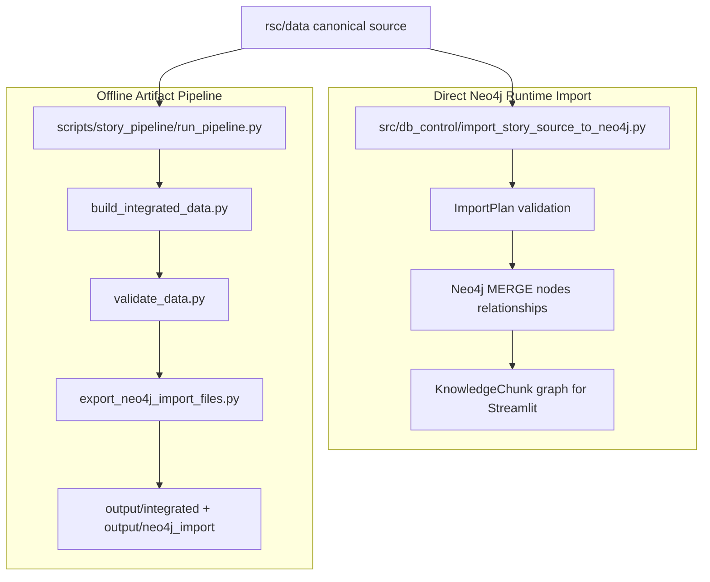

# 03. Importer And Pipeline

## 한 줄 요약

이 프로젝트에는 두 개의 데이터 처리 경로가 있다. **Direct importer**는 `rsc/data`를 바로 Neo4j runtime graph로 MERGE한다. **Offline pipeline**은 `output/integrated`와 `output/neo4j_import` 산출물을 생성하고 검증한다.

## 두 경로 비교



Image-generation prompt:

```text
Create a split pipeline image. Left branch: rsc/data to direct Neo4j importer to runtime KnowledgeChunk graph. Right branch: rsc/data to offline integrated data validation to CSV/Cypher artifacts. Make clear that both start from rsc/data but serve different purposes.
```

## Direct importer: runtime graph path

File: `src/db_control/import_story_source_to_neo4j.py`  
Purpose: 원천 Markdown/YAML을 runtime retrieval에 필요한 Neo4j graph로 적재  
Inputs: `rsc/data/npcs`, `rsc/data/quests`, `rsc/data/world`, `rsc/data/locations`  
Outputs: `NPC`, `Quest`, `Role`, `Location`, `Event`, `Clue`, `Truth`, `KnowledgeChunk` nodes and relationships  
Invariant: `--reset`은 destructive이므로 명시 승인 없이는 실행하지 않는다.

### ImportPlan validation 핵심

```python
def validate_import_plan(plan: ImportPlan) -> list[str]:
    errors: list[str] = []
    npc_ids = {str(npc["npc_id"]) for npc in plan.npcs}
    quest_ids = {str(quest["quest_id"]) for quest in plan.quests}
    clue_ids = {str(clue["clue_id"]) for clue in plan.world["clues"]}
    truth_ids = {str(truth["truth_id"]) for truth in plan.world["truths"]}
    chunk_counts = dict(Counter(str(chunk["npc_id"]) for chunk in plan.chunks))
    expected_chunk_total = sum(EXPECTED_CHUNK_COUNTS.values())
    if len(plan.chunks) != expected_chunk_total:
        errors.append(f"KnowledgeChunk count changed: expected {expected_chunk_total}, got {len(plan.chunks)}")
    if chunk_counts != EXPECTED_CHUNK_COUNTS:
        errors.append(f"KnowledgeChunk distribution changed: expected {EXPECTED_CHUNK_COUNTS}, got {chunk_counts}")
```

### Constraint 생성

```python
def create_constraints(driver) -> None:
    queries = [
        """
        CREATE CONSTRAINT npc_id_unique IF NOT EXISTS
        FOR (n:NPC)
        REQUIRE n.npc_id IS UNIQUE
        """,
        """
        CREATE CONSTRAINT chunk_id_unique IF NOT EXISTS
        FOR (k:KnowledgeChunk)
        REQUIRE k.chunk_id IS UNIQUE
        """,
    ]
    for query in queries:
        driver.execute_query(query)
```

### 안전 실행 명령

```powershell
uv run --frozen python src/db_control/import_story_source_to_neo4j.py --source-dir rsc/data --dry-run --database neo4j
```

실제 merge import는 DB 대상과 credential을 확인한 뒤 실행한다. DB wipe가 필요한 경우에만 `--reset`을 쓰며, 이 작업은 destructive이다.

## Offline pipeline: generated artifact path

File: `scripts/story_pipeline/run_pipeline.py`  
Purpose: 통합 YAML/JSON과 Neo4j import file을 생성  
Inputs: `rsc/data`  
Outputs: `output/integrated`, `output/neo4j_import`, validation report  
Invariant: pipeline 결과물은 재생성 가능하며 canonical source가 아니다.

```python
def main() -> None:
    parser = argparse.ArgumentParser()
    parser.add_argument("--load-neo4j", action="store_true")
    args = parser.parse_args()

    run_step("build_integrated_data.py")
    run_step("validate_data.py")
    run_step("export_neo4j_import_files.py")
    run_step("validate_data.py")
    if args.load_neo4j:
        run_step("load_neo4j.py")
    print("Pipeline complete")
```

## CSV export 핵심

File: `scripts/story_pipeline/export_neo4j_import_files.py`  
Purpose: integrated data를 Neo4j import CSV로 변환  
Invariant: relationship 중복은 `REL_HEADER` tuple 기준으로 제거한다.

```python
for quest in data["quests"]:
    for npc_id in quest["involved_npc_ids"]:
        add_relationship(relationships, "NPC", npc_id, "INVOLVED_IN", "Quest", quest["id"])
    for clue_id in quest["required_clue_ids"]:
        add_relationship(relationships, "Quest", quest["id"], "REQUIRES_CLUE", "Clue", clue_id)
    for truth_id in quest["answer_truth_ids"]:
        add_relationship(relationships, "Quest", quest["id"], "REVEALS_TRUTH", "Truth", truth_id)
```

## Validation 핵심

File: `scripts/story_pipeline/validate_data.py`  
Purpose: integrated data의 cross-reference 무결성 검증  
Invariant: Quest가 참조한 clue/truth, Dialogue가 참조한 NPC/Quest는 모두 존재해야 한다.

```python
def validate_ids(data: dict[str, Any]) -> list[str]:
    errors: list[str] = []
    clue_ids = {clue["id"] for clue in data["clues"]}
    truth_ids = {truth["id"] for truth in data["truths"]}
    npc_ids = {npc["id"] for npc in data["npcs"]}
    quest_ids = {quest["id"] for quest in data["quests"]}
    for quest in data["quests"]:
        for field, valid_ids in [("required_clue_ids", clue_ids), ("optional_clue_ids", clue_ids), ("answer_truth_ids", truth_ids)]:
            missing = sorted(set(quest[field]) - valid_ids)
            if missing:
                errors.append(f"{quest['id']} missing {field}: {missing}")
    return errors
```

## 실행 명령 요약

```powershell
uv run --frozen python scripts/story_pipeline/run_pipeline.py
uv run --frozen python scripts/story_pipeline/validate_data.py
uv run --frozen python scripts/story_pipeline/run_pipeline.py --load-neo4j
```

## 인수인계 포인트

- Streamlit runtime이 바로 쓰는 것은 direct importer로 만들어진 `KnowledgeChunk` graph다.
- `scripts/story_pipeline`은 발표/검증/CSV import artifact 생성에 유용하지만, runtime retrieval과 1:1로 같지 않다.
- 둘의 차이를 섞어 설명하면 QA 근거와 운영 경로가 혼동된다.
