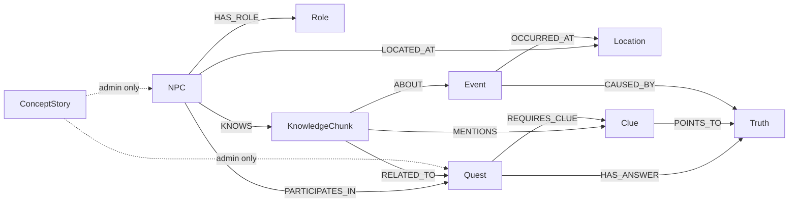
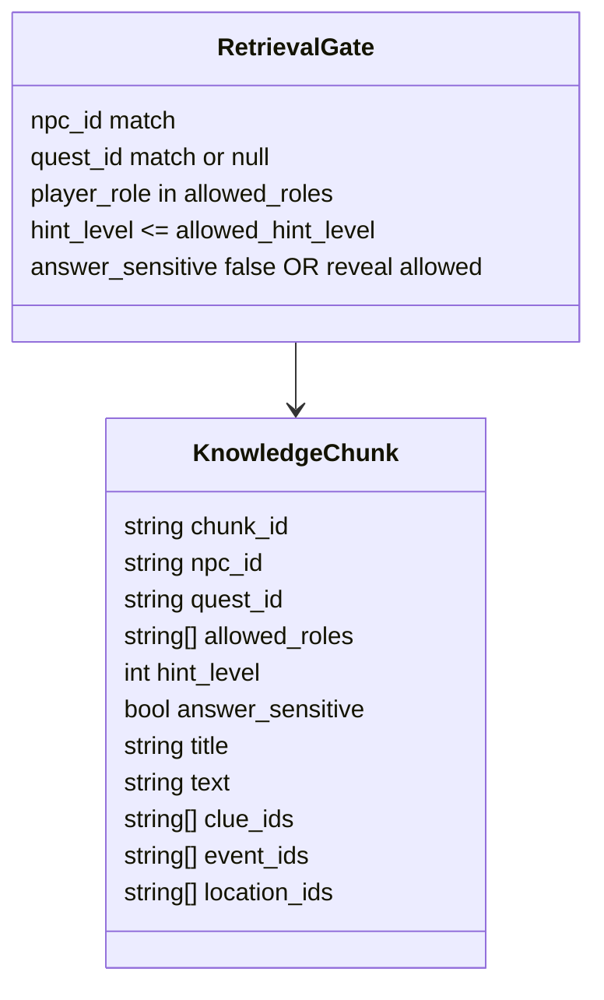

# 04. Neo4j Graph Contract

## 한 줄 요약

Neo4j graph는 NPC 대화 retrieval과 Admin concept loading의 기준 저장소다. Runtime retrieval에서 가장 중요한 node는 `NPC`와 `KnowledgeChunk`이며, quest progression은 `Clue`, `Truth`, `Quest` ID와 맞물린다.

## Runtime graph overview



Image-generation prompt:

```text
Create a Neo4j graph contract image. Put NPC and KnowledgeChunk in the center because Streamlit retrieval depends on them. Put Quest, Clue, Truth around them. Add ConceptStory as a separate admin-only dashed node.
```

## Label별 책임

| Label | 주요 속성 | 생성 경로 | Runtime 사용 |
|---|---|---|---|
| `NPC` | `npc_id`, `name`, `role`, `location_id`, `dialogue_must`, `dialogue_must_not` | direct importer | profile, retrieval start node |
| `KnowledgeChunk` | `chunk_id`, `npc_id`, `quest_id`, `allowed_roles`, `hint_level`, `answer_sensitive`, `text` | direct importer | prompt context |
| `Quest` | `quest_id`, `title`, `quest_type`, `states` | direct importer/pipeline | quest selector, rule references |
| `Clue` | `clue_id`, `name`, `hint_level`, `answer_sensitive` | world YAML | progression and reveal preconditions |
| `Truth` | `truth_id`, `name`, `answer_sensitive` | world YAML | final reveal target |
| `Location` | `location_id`, `name`, `summary`, `tags` | locations Markdown | graph context |
| `Event` | `event_id`, `name`, `summary`, `visible` | world events | story cause/evidence context |
| `Role` | `role_id`, `name`, `description` | world roles | player role gate |
| `ConceptStory` | `concept_id`, `category`, `title`, `text`, `quest_id`, `npc_id` | Admin UI | admin-loaded standalone concept node |

## Retrieval-relevant KnowledgeChunk fields



Image-generation prompt:

```text
Create a class-style card for KnowledgeChunk and a separate RetrievalGate card. Show arrows from gate predicates to chunk properties. Emphasize answer_sensitive and hint_level as safety gates.
```

## Direct importer가 만드는 핵심 관계

File: `src/db_control/import_story_source_to_neo4j.py`  
Purpose: `rsc/data`를 graph node/relationship으로 MERGE  
Invariant: 기존 관계는 삭제 후 새 source 기준으로 다시 MERGE하여 stale relationship을 줄인다.

```cypher
MERGE (n:NPC {npc_id: $npc_id})
SET n.name = $name,
    n.role = $role,
    n.location_id = $location_id,
    n.main_quest = $main_quest,
    n.personality = $personality,
    n.speech_style = $speech_style,
    n.dialogue_must = $dialogue_must,
    n.dialogue_must_not = $dialogue_must_not

WITH n
MERGE (r:Role {role_id: $role})
MERGE (n)-[:HAS_ROLE]->(r)
MERGE (loc:Location {location_id: $location_id})
MERGE (n)-[:LOCATED_AT]->(loc)
```

## Runtime retrieval query

File: `src/streamlit/test_app.py#get_allowed_chunks`  
Purpose: 현재 NPC/Quest/Role/State에 허용된 chunk만 가져온다.  
Invariant: `answer_sensitive = true` chunk는 `answer_reveal_allowed = true`이고 quest state가 `ready_to_answer` 또는 `solved`일 때만 검색된다.

```cypher
MATCH (:NPC {npc_id: $npc_id})-[:KNOWS]->(k:KnowledgeChunk)
WHERE
  ($quest_id IS NULL OR k.quest_id = $quest_id OR k.quest_id IS NULL)
  AND $player_role IN k.allowed_roles
  AND k.hint_level <= $allowed_hint_level
  AND (k.answer_sensitive = false OR ($answer_reveal_allowed = true AND $quest_state IN ["ready_to_answer", "solved"]))
RETURN k.chunk_id AS chunk_id, k.title AS title, k.text AS text
ORDER BY CASE WHEN k.quest_id = $quest_id THEN 0 ELSE 1 END,
         k.hint_level DESC,
         k.chunk_id ASC
LIMIT $limit
```

## 검증용 Cypher

```cypher
MATCH (k:KnowledgeChunk) RETURN count(k) AS chunks;

MATCH (:NPC)-[:KNOWS]->(k:KnowledgeChunk)
RETURN k.npc_id AS npc_id, count(k) AS chunks
ORDER BY npc_id;

MATCH (q:Quest)-[:REQUIRES_CLUE]->(c:Clue)
RETURN q.quest_id AS quest, collect(c.clue_id) AS required_clues
ORDER BY quest;

MATCH (q:Quest)-[:HAS_ANSWER]->(t:Truth)
RETURN q.quest_id AS quest, collect(t.truth_id) AS answer_truths
ORDER BY quest;
```

## 인수인계 포인트

- Retrieval은 vector search가 아니라 graph-scoped symbolic filtering이다.
- `answer_sensitive`는 보안/스포일러 gate 역할이다. 이 필드를 낮은 hint level에 두면 importer validation에서 막아야 한다.
- `ConceptStory`는 Admin에서 별도 MERGE하는 보조 지식 노드이며, 현재 일반 NPC retrieval query에는 들어가지 않는다.
