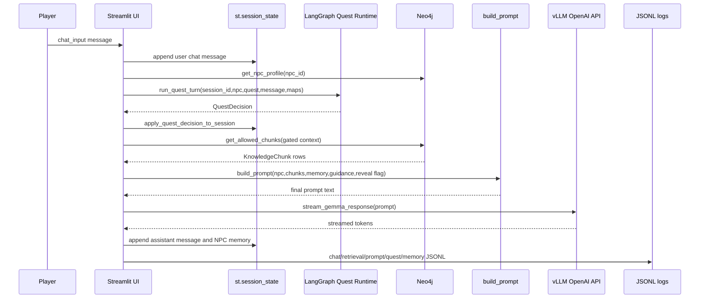
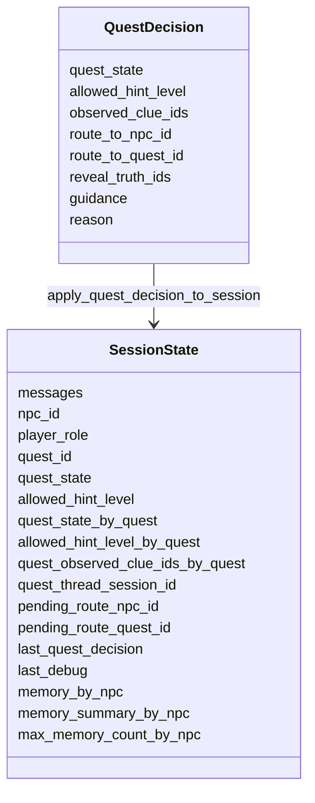
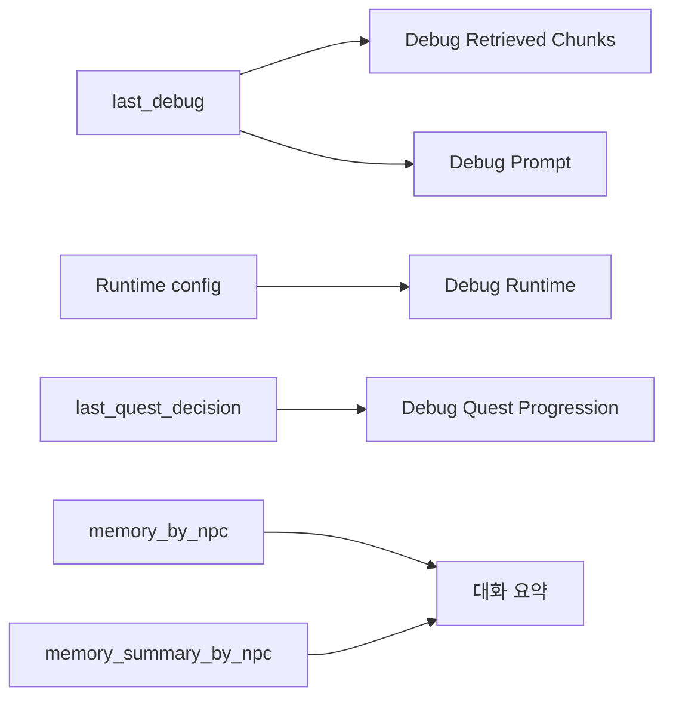

# 05. Streamlit Runtime

## 한 줄 요약

`src/streamlit/test_app.py`는 사용자의 한 번의 채팅 입력을 `session_state` 갱신, LangGraph quest 판정, Neo4j `KnowledgeChunk` retrieval, prompt 조립, vLLM streaming, 메모리/로그 기록까지 연결하는 런타임 오케스트레이터다.

## Runtime turn sequence



Image-generation prompt:

```text
Create a technical sequence image for one Streamlit chat turn. Show Streamlit as the central orchestrator. The turn must flow through session state, LangGraph quest decision, Neo4j retrieval, prompt assembly, vLLM streaming, and split JSONL logs. Emphasize that chat logs contain only input/output, while prompt and retrieval logs are separate.
```

## Runtime 파일 책임

| 코드 영역 | 파일/함수 | 책임 | 인수인계 주의점 |
|---|---|---|---|
| config | `test_app.py` lines 46-69 | Neo4j, vLLM, model, log path, context budget default | Docker env가 있으면 기본값을 override한다. |
| quest controls | `sync_npc_metadata`, `sync_quest_metadata`, `restore_quest_controls_for_current_quest` | NPC/Quest/Role/Hints 동기화 | NPC 선택은 role과 quest를 자동으로 바꾼다. |
| quest state | `apply_quest_decision_to_session` | `QuestDecision`을 session map에 반영 | route 추천과 last decision debug도 여기서 갱신된다. |
| memory | `add_npc_memory_turn`, `compact_npc_memory_if_needed`, `compact_npc_memory_for_prompt_if_needed` | NPC별 세션 메모리 유지/압축 | DB에 저장하지 않는다. 세션 전용이다. |
| retrieval | `get_npc_profile`, `get_allowed_chunks` | Neo4j profile/context fetch | answer-sensitive gate를 반드시 유지한다. |
| streaming | `stream_gemma_response` | OpenAI-compatible SSE stream parsing | 에러를 채팅 본문으로 yield하지 않고 `VllmRequestError`로 분리한다. |
| UI diagnostics | `render_sidebar_diagnostics` | chunk/prompt/runtime/quest debug popover | chat input 밖에서 렌더링되어 마지막 디버그가 유지된다. |
| chat log | `build_interaction_log`, `append_interaction_log` | conversation-only JSONL | prompt/chunk/model metadata를 chat log에 섞지 않는다. |

## Config and context budget

File: `src/streamlit/test_app.py`  
Purpose: 운영 기본값과 prompt budget을 한 곳에서 정의한다.  
Invariant: response token 512개를 먼저 예약한 뒤 남은 budget으로 prompt/memory 압축 기준을 잡는다.

```python
NEO4J_URI = os.getenv("NEO4J_URI", "bolt://localhost:7687")
NEO4J_USER = os.getenv("NEO4J_USER", "neo4j")
NEO4J_PASSWORD = os.getenv("NEO4J_PASSWORD", "admin2026")

VLLM_URL = os.getenv("VLLM_URL", "http://localhost:8000/v1/chat/completions")
MODEL_NAME = os.getenv("MODEL_NAME", "google/gemma-4-E4B-it")
LOG_PATHS = {
    "chat": Path(os.getenv("CHAT_LOG_PATH", "output/reports/streamlit_llm_interactions.jsonl")),
    "retrieval": Path(os.getenv("RETRIEVAL_LOG_PATH", "output/reports/streamlit_retrieval_events.jsonl")),
    "prompt": Path(os.getenv("PROMPT_LOG_PATH", "output/reports/streamlit_prompt_events.jsonl")),
    "quest": Path(os.getenv("QUEST_LOG_PATH", "output/reports/streamlit_quest_events.jsonl")),
    "memory": Path(os.getenv("MEMORY_LOG_PATH", "output/reports/streamlit_memory_events.jsonl")),
    "admin": Path(os.getenv("ADMIN_LOG_PATH", "output/reports/streamlit_admin_events.jsonl")),
    "neo4j_import": Path(os.getenv("NEO4J_IMPORT_LOG_PATH", "output/reports/streamlit_neo4j_import_events.jsonl")),
}

DEFAULT_MAX_MEMORY_COUNT = 40
MAX_CONTEXT_TOKENS = 4096
VLLM_MAX_RESPONSE_TOKENS = 512
MAX_PROMPT_CONTEXT_UNITS = MAX_CONTEXT_TOKENS - VLLM_MAX_RESPONSE_TOKENS
MEMORY_COMPACTION_RATIO = 0.9
```

세부 설명:

- `MODEL_NAME` 기본값은 운영 compose의 E4B와 맞춘다.
- design-test stack에서는 `.env.design-test.example`이 E2B로 override한다.
- `LOG_PATHS`는 feature별 로그를 분리한다. 발표 이미지에서는 chat, retrieval, prompt, quest, memory를 별도 박스로 그린다.
- `MAX_PROMPT_CONTEXT_UNITS`는 엄밀한 tokenizer가 아니라 UTF-8 byte 기반의 local estimate다. 목적은 vLLM max context를 넘기기 전에 memory를 보수적으로 압축하는 것이다.

## Session state map



Image-generation prompt:

```text
Create a class diagram showing Streamlit session_state as a large state container. Group fields into chat messages, selected NPC/quest, per-quest progression maps, routing recommendation, debug snapshot, and per-NPC memory. Show QuestDecision writing into quest maps and pending route fields.
```

## NPC/Quest selection synchronization

File: `src/streamlit/test_app.py`  
Purpose: 선택한 NPC나 Quest에 맞춰 role, quest, hint level을 자동 동기화한다.  
Invariant: sidebar에서 Quest State와 Allowed Hint Level을 직접 조작하지 않는다. Admin page에서만 수동 override한다.

```python
def sync_npc_metadata() -> None:
    previous_npc_id = st.session_state.get("previous_npc_id", DEFAULT_NPC_ID)
    metadata = NPC_METADATA[st.session_state.npc_id]
    st.session_state.player_role = metadata.player_role
    st.session_state.quest_id = metadata.quest_id
    if st.session_state.get("pending_route_npc_id") == st.session_state.npc_id:
        st.session_state.pending_route_npc_id = None
    restore_quest_controls_for_current_quest()
    append_feature_log("admin", {"event": "npc_changed", "previous_npc_id": previous_npc_id, "npc_id": st.session_state.npc_id})
    append_feature_log("admin", {"event": "quest_auto_selected", "npc_id": st.session_state.npc_id, "quest_id": st.session_state.quest_id})
    append_feature_log("admin", {"event": "role_changed", "npc_id": st.session_state.npc_id, "player_role": st.session_state.player_role, "source": "npc_auto_sync"})
    st.session_state.previous_npc_id = st.session_state.npc_id
```

작은 기능별 설명:

- `NPC_METADATA`는 NPC별 기본 `player_role`과 `quest_id`를 가진다.
- NPC가 바뀌면 role과 quest도 같이 바뀐다.
- `restore_quest_controls_for_current_quest()`가 quest별 저장 state를 현재 control 값으로 복원한다.
- 이 동작은 사용자가 잘못된 NPC/Role/Quest 조합으로 prompt를 만드는 것을 줄인다.

## Quest decision application

File: `src/streamlit/test_app.py`  
Purpose: LangGraph가 반환한 결정을 UI 상태에 반영한다.  
Invariant: `QuestDecision`은 현재 quest뿐 아니라 route recommendation과 debug view까지 업데이트한다.

```python
def apply_quest_decision_to_session(decision: QuestDecision) -> None:
    apply_decision_to_maps(
        decision=decision,
        quest_state_by_quest=st.session_state.quest_state_by_quest,
        allowed_hint_level_by_quest=st.session_state.allowed_hint_level_by_quest,
        observed_clue_ids_by_quest=st.session_state.quest_observed_clue_ids_by_quest,
    )
    if st.session_state.quest_id == decision.quest_id:
        st.session_state.quest_state = decision.quest_state
        st.session_state.allowed_hint_level = decision.allowed_hint_level
    st.session_state.last_quest_decision = decision.as_record()
    st.session_state.pending_route_npc_id = decision.route_to_npc_id
    st.session_state.pending_route_quest_id = decision.route_to_quest_id
```

시각화 포인트:

- `quest_state_by_quest`: 모든 quest의 진행 상태 저장.
- `allowed_hint_level_by_quest`: retrieval gate에 들어갈 hint cap 저장.
- `quest_observed_clue_ids_by_quest`: 이미 본 단서 목록 저장.
- `pending_route_npc_id`: sidebar에 “이 NPC에게 이동” 버튼을 띄우는 값.

## Per-NPC memory lifecycle

```mermaid
flowchart TD
    A[User/Assistant chat message] --> B[add_npc_memory_turn]
    B --> C[memory_by_npc[npc_id] append]
    C --> D{turn count > max_memory_count?}
    D -- yes --> E[merge_memory_summary]
    E --> F[keep latest max count turns]
    D -- no --> G[keep as recent memory]
    G --> H[get_npc_memory_context]
    F --> H
    H --> I[build_prompt conversation_context]
    I --> J{prompt units exceed threshold?}
    J -- yes --> K[compact_npc_memory_for_prompt_if_needed]
    K --> L[summary only, recent turns cleared]
    J -- no --> M[use prompt as-is]
```

Image-generation prompt:

```text
Create a lifecycle image for per-NPC Streamlit memory. Show recent turns and summary as session-only storage. Show two compaction triggers: max turn count and prompt-size threshold. Make clear that no ChatMemory node is written to Neo4j.
```

핵심 코드:

```python
def compact_npc_memory_for_prompt_if_needed(npc_id: str, prompt: str) -> bool:
    threshold = int(MAX_PROMPT_CONTEXT_UNITS * MEMORY_COMPACTION_RATIO)
    if estimate_prompt_units(prompt) < threshold:
        return False

    turns = st.session_state.memory_by_npc.setdefault(npc_id, [])
    if not turns:
        return False

    st.session_state.memory_summary_by_npc[npc_id] = merge_memory_summary(
        st.session_state.memory_summary_by_npc.get(npc_id, ""),
        turns,
    )
    st.session_state.memory_by_npc[npc_id] = []
    append_feature_log(
        "memory",
        {
            "event": "context_compacted",
            "npc_id": npc_id,
            "threshold": threshold,
            "prompt_units": estimate_prompt_units(prompt),
        },
    )
    return True
```

설명:

- turn count 압축은 대화가 너무 길 때 오래된 turn을 summary로 병합한다.
- prompt-size 압축은 vLLM 호출 직전 prompt가 너무 커질 때 전체 recent turn을 summary에 흡수한다.
- 압축 후 `build_prompt`를 한 번 더 호출한다. 그래야 줄어든 memory context가 prompt에 반영된다.
- memory는 NPC별이다. 민민과 로완의 최근 대화가 섞이지 않는다.

## vLLM streaming path

File: `src/streamlit/test_app.py#stream_gemma_response`  
Purpose: OpenAI-compatible `/v1/chat/completions` streaming 응답을 Streamlit `write_stream`에 전달한다.  
Invariant: 네트워크/HTTP/JSON 에러는 assistant chat text로 yield하지 않는다.

```python
def stream_gemma_response(prompt: str):
    payload = {
        "model": MODEL_NAME,
        "messages": [{"role": "user", "content": prompt}],
        "temperature": 0.7,
        "top_p": 0.9,
        "max_tokens": VLLM_MAX_RESPONSE_TOKENS,
        "stream": True,
    }

    try:
        with requests.post(VLLM_URL, json=payload, stream=True, timeout=180) as response:
            response.raise_for_status()
            for line in response.iter_lines():
                if not line:
                    continue
                line = line.decode("utf-8")
                if not line.startswith("data: "):
                    continue
                data = line[len("data: "):].strip()
                if data == "[DONE]":
                    break
                obj = json.loads(data)
                delta = obj["choices"][0].get("delta", {})
                content = delta.get("content")
                if content:
                    yield content
    except requests.exceptions.ConnectionError:
        raise VllmRequestError(...)
```

에러 처리:

```python
except VllmRequestError as e:
    append_feature_log(
        "prompt",
        {
            "event": "vllm_http_error",
            "npc_id": st.session_state.npc_id,
            "quest_id": st.session_state.quest_id,
            "status_code": e.status_code,
            "response_body": e.response_body[:2000],
            "prompt_units": estimate_prompt_units(prompt),
        },
    )
    with st.chat_message("assistant"):
        st.error(e.display_message)
```

중요한 차이:

- vLLM 오류는 `prompt` feature log에 기록된다.
- 오류는 `st.error()`로 사용자에게 표시된다.
- 오류 메시지는 `st.session_state.messages`, NPC memory, chat interaction log에 들어가지 않는다.
- 일반 예외는 assistant message로 추가된다. vLLM 통신 오류와 앱 내부 예외를 구분하기 위한 설계다.

## Chat log contract

File: `src/streamlit/chat_logging.py`  
Purpose: 실제 사용자 질문과 NPC 답변만 저장한다.  
Invariant: prompt, chunk, model, selection debug는 chat log에 넣지 않는다.

```python
def build_interaction_log(user_message: str, response_text: str) -> dict[str, str]:
    return {
        "input": user_message,
        "output": response_text,
    }


def append_interaction_log(path: Path, record: dict[str, str]) -> None:
    path.parent.mkdir(parents=True, exist_ok=True)
    with path.open("a", encoding="utf-8") as log_file:
        log_file.write(json.dumps(record, ensure_ascii=False) + "\n")
```

이 설계의 이유:

- 발표/QA에서 사용자의 질문과 모델 답변만 비교하기 쉽다.
- 민감한 prompt 내부 구조나 retrieval chunk가 chat log에 섞이지 않는다.
- retrieval/prompt/quest 디버깅은 별도 JSONL에서 추적한다.

## 한 턴의 실제 코드 흐름

File: `src/streamlit/test_app.py` chat input block  
Purpose: 사용자 메시지 하나를 end-to-end 처리한다.

```python
if user_message := st.chat_input("메세지를 입력하세요"):
    user_chat_message = build_chat_message(...)
    st.session_state.messages.append(user_chat_message)

    try:
        npc = get_npc_profile(st.session_state.npc_id)
        npc_name = str(npc.get("name") or NPC_NAMES.get(st.session_state.npc_id, st.session_state.npc_id))

        quest_decision = run_quest_turn(
            session_id=st.session_state.quest_thread_session_id,
            npc_id=st.session_state.npc_id,
            quest_id=st.session_state.quest_id,
            user_message=user_message,
            quest_state_by_quest=st.session_state.quest_state_by_quest,
            observed_clue_ids_by_quest=st.session_state.quest_observed_clue_ids_by_quest,
        )
        apply_quest_decision_to_session(quest_decision)
        answer_reveal_allowed = bool(quest_decision.reveal_truth_ids) or (
            st.session_state.npc_id == CHIEF_NPC_ID and st.session_state.quest_state == "solved"
        )

        chunks = get_allowed_chunks(...)
        prompt = build_prompt(...)
        if compact_npc_memory_for_prompt_if_needed(st.session_state.npc_id, prompt):
            prompt = build_prompt(...)

        response = st.write_stream(stream_gemma_response(prompt))
        response_text = normalize_stream_response(response)
        assistant_chat_message = build_chat_message(...)
        st.session_state.messages.append(assistant_chat_message)
        add_npc_memory_turn(st.session_state.npc_id, user_chat_message)
        add_npc_memory_turn(st.session_state.npc_id, assistant_chat_message)
        append_interaction_log(build_interaction_log(user_message=user_message, response_text=response_text))
```

작은 기능별 설명:

1. 사용자 메시지를 먼저 화면과 session history에 추가한다.
2. Neo4j에서 현재 NPC profile을 읽는다.
3. LangGraph quest runtime이 state, clue, route, reveal decision을 계산한다.
4. reveal flag를 계산한다. `reveal_truth_ids`가 있거나 로완이 solved 상태일 때만 정답 공개 context가 가능하다.
5. Neo4j에서 현재 조건에 맞는 `KnowledgeChunk`만 검색한다.
6. `build_prompt`가 NPC 정보, 메모리, chunk, guidance, reveal policy를 결합한다.
7. prompt가 커지면 memory를 압축하고 prompt를 재생성한다.
8. vLLM streaming 결과를 assistant message로 저장한다.
9. 사용자/assistant turn을 NPC별 memory에 추가한다.
10. conversation-only chat log를 쓴다.

## Sidebar diagnostics



Image-generation prompt:

```text
Create a Streamlit sidebar diagnostic panel image. Include popovers for Retrieved Chunks, Prompt, Runtime, and Quest Progression. Below them show per-NPC memory summaries. Make clear these are debug surfaces, not part of NPC dialogue.
```

핵심 코드:

```python
def render_sidebar_diagnostics(container: DeltaGenerator) -> None:
    with container:
        last_debug = st.session_state.last_debug
        with st.popover("Debug: Retrieved Chunks"):
            st.write(last_debug.get("retrieved_chunks", []))
        with st.popover("Debug: Prompt"):
            st.code(str(last_debug.get("prompt", "")))
        with st.popover("Debug: Runtime"):
            st.caption(f"Model: {MODEL_NAME}")
            st.caption(f"vLLM: {VLLM_URL}")
            st.caption(f"Neo4j: {NEO4J_URI}")
            st.caption(f"Log: {CHAT_LOG_PATH}")
        with st.popover("Debug: Quest Progression"):
            st.write(st.session_state.get("last_quest_decision", {}))
            st.write(st.session_state.get("quest_observed_clue_ids_by_quest", {}))
```

## 인수인계 포인트

- `test_app.py`는 Streamlit 특성상 import 자체가 UI 실행을 트리거한다. 테스트에서는 소스 문자열 검사 또는 quest/prompt helper 직접 호출 위주로 검증한다.
- NPC chat page와 Admin page를 섞지 않는다. Admin tabs는 `src/streamlit/pages/admin.py`에만 있다.
- `answer_reveal_allowed`는 prompt와 retrieval 양쪽에 모두 영향을 준다. 하나만 바꾸면 스포일러 gate가 깨진다.
- vLLM 오류를 chat memory에 넣지 않는 계약은 테스트로 보호된다.
- `output/reports/*.jsonl`은 런타임 증거다. canonical source가 아니다.
