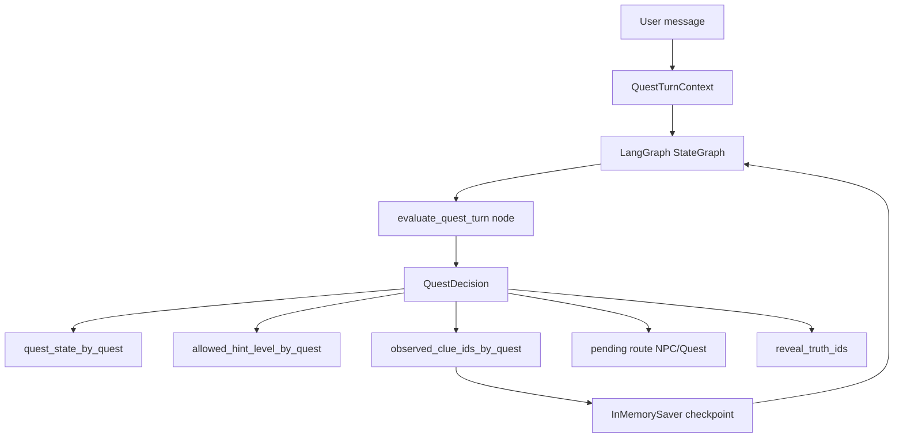
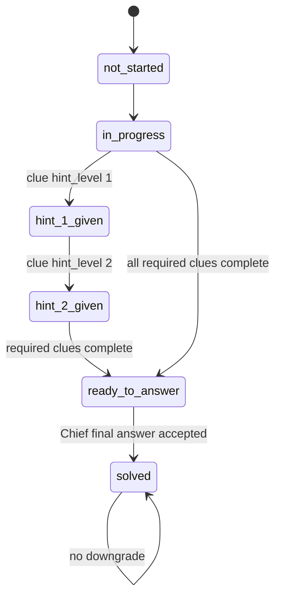
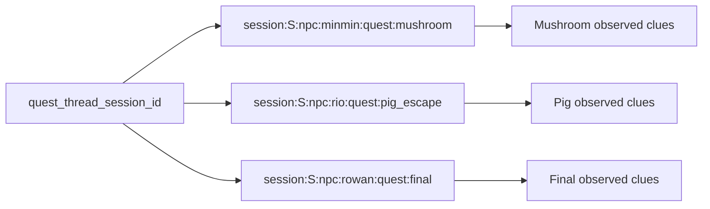
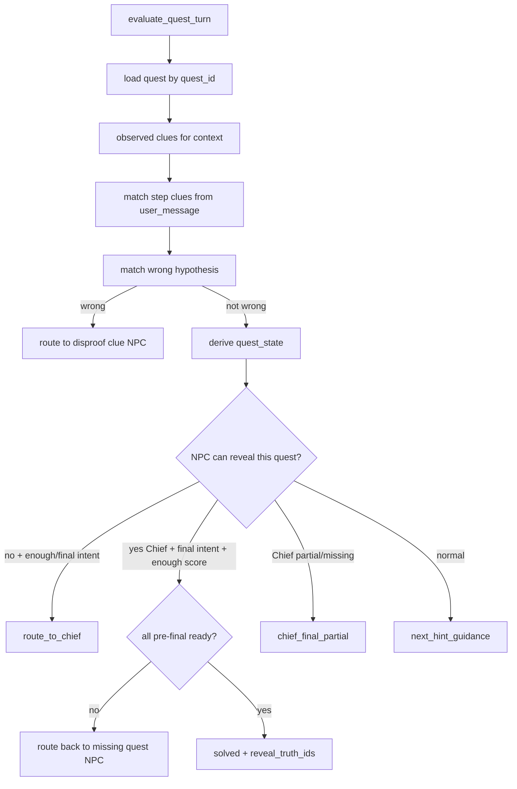
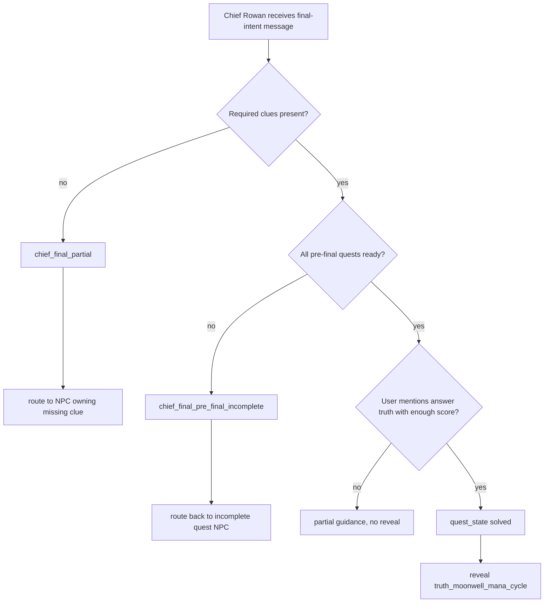
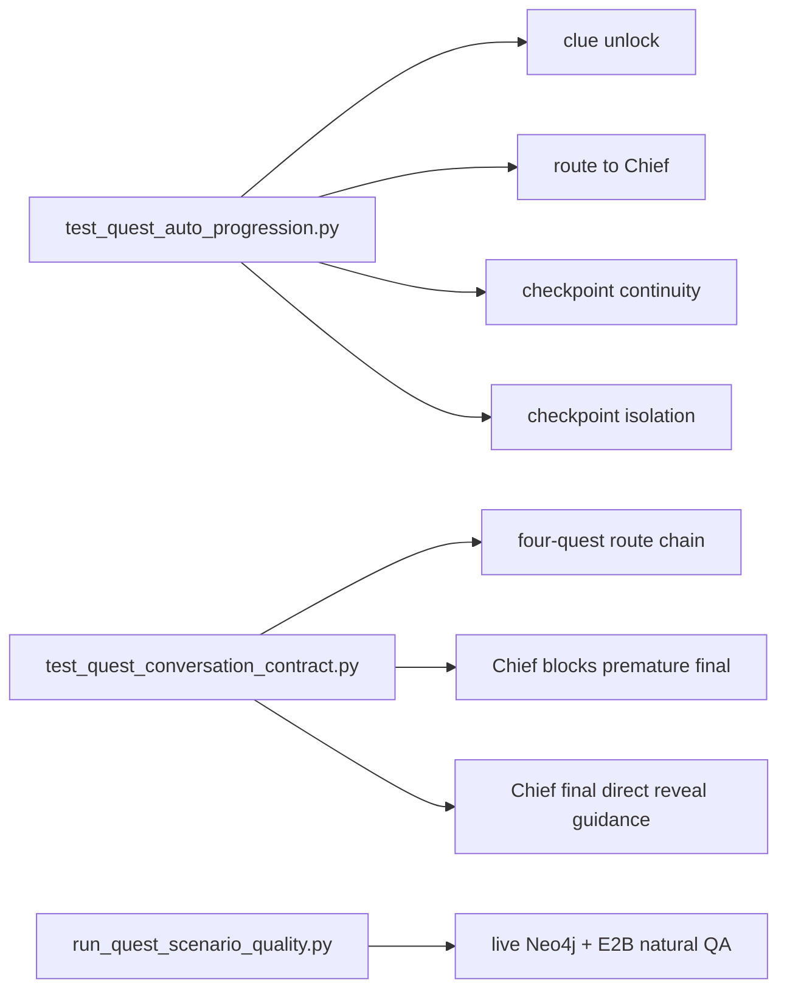

# 06. LangGraph Quest Progression

## 한 줄 요약

LangGraph는 이 프로젝트에서 자유로운 agent planner가 아니라, `QuestGraphState`를 checkpoint로 기억하면서 `evaluate_quest_turn` 한 노드를 실행하는 **퀘스트 상태 판정 runner**다.

## Quest progression overview



Image-generation prompt:

```text
Create a LangGraph quest progression diagram. Present LangGraph as a deterministic state runner, not an autonomous agent. Show user message entering QuestTurnContext, evaluate_quest_turn producing QuestDecision, and InMemorySaver preserving observed clues per thread.
```

## 핵심 파일 지도

| 파일 | 책임 | Runtime 영향 |
|---|---|---|
| `src/streamlit/quest_types.py` | NPC/Quest 상수, dataclass, TypedDict 계약 | 모든 quest state와 decision shape 기준 |
| `src/streamlit/quest_loader.py` | `rsc/data/quests/*.yaml`, `world/clues.yaml`, `world/truths.yaml` 로드 | rule set 생성 |
| `src/streamlit/quest_rules.py` | clue matching, wrong hypothesis, route, final reveal 판정 | 실제 quest business logic |
| `src/streamlit/quest_graph.py` | `StateGraph(QuestGraphState)` 구성 | LangGraph node/checkpointer |
| `src/streamlit/quest_runtime.py` | thread id, checkpoint merge, graph.invoke, map update | Streamlit과 LangGraph 연결 |
| `test_script/test_quest_auto_progression.py` | 상태 전이 단위/통합 계약 | 자동 진행과 checkpoint 검증 |
| `test_script/test_quest_conversation_contract.py` | multi-quest 대화 흐름 계약 | 로완 route/final gate 검증 |

## QuestGraphState contract

File: `src/streamlit/quest_types.py`  
Purpose: LangGraph state와 decision record의 형태를 고정한다.  
Invariant: graph node는 `decision` record를 state에 추가해서 반환한다.

```python
class QuestGraphState(TypedDict):
    npc_id: str
    quest_id: str
    user_message: str
    quest_state_by_quest: dict[str, str]
    observed_clue_ids_by_quest: dict[str, list[str]]
    decision: NotRequired[QuestDecisionRecord]
```

관련 dataclass:

```python
@dataclass(frozen=True, slots=True)
class QuestDecision:
    npc_id: str
    quest_id: str
    quest_state: str
    allowed_hint_level: int
    observed_clue_ids: tuple[str, ...]
    newly_unlocked_clue_ids: tuple[str, ...]
    route_to_npc_id: str | None
    route_to_quest_id: str | None
    missing_clue_ids: tuple[str, ...]
    disproof_clue_ids: tuple[str, ...]
    reveal_truth_ids: tuple[str, ...]
    guidance: str
    reason: str
```

작은 기능별 설명:

- `quest_state`는 현재 quest의 progression state다.
- `allowed_hint_level`은 retrieval gate와 prompt label에 들어간다.
- `observed_clue_ids`는 checkpoint와 session map에 저장되는 evidence memory다.
- `route_to_npc_id`/`route_to_quest_id`는 sidebar route recommendation을 만든다.
- `reveal_truth_ids`가 비어 있지 않을 때 최종 정답 공개가 가능해진다.
- `guidance`는 prompt에 들어가 NPC가 이번 답변에서 반드시 말해야 할 진행 안내가 된다.

## State and hint level ladder



Image-generation prompt:

```text
Create a quest state ladder image. Show not_started, in_progress, hint_1_given, hint_2_given, ready_to_answer, solved. Annotate allowed hint levels: 0, 1, 1, 2, 3, 3. Emphasize that solved never downgrades and only Chief Rowan can finalize.
```

Code contract:

```python
QUEST_STATE_HINT_LEVELS: Final[dict[str, int]] = {
    "not_started": 0,
    "in_progress": 1,
    "hint_1_given": 1,
    "hint_2_given": 2,
    "ready_to_answer": 3,
    "solved": 3,
}
```

## LangGraph graph construction

File: `src/streamlit/quest_graph.py`  
Purpose: rule set을 캡처한 단일 evaluation node를 LangGraph로 compile한다.  
Invariant: graph topology는 `START -> evaluate_quest_turn -> END` 하나뿐이다.

```python
def build_quest_graph(rule_set: QuestRuleSet):
    builder = StateGraph(QuestGraphState)

    def evaluate_node(state: QuestGraphState) -> QuestGraphState:
        context = QuestTurnContext(
            npc_id=state["npc_id"],
            quest_id=state["quest_id"],
            user_message=state["user_message"],
            quest_state_by_quest=state["quest_state_by_quest"],
            observed_clue_ids_by_quest={
                quest_id: tuple(clue_ids)
                for quest_id, clue_ids in state["observed_clue_ids_by_quest"].items()
            },
        )
        decision = evaluate_quest_turn(rule_set, context)
        updated_observed = dict(state["observed_clue_ids_by_quest"])
        updated_observed[decision.quest_id] = list(decision.observed_clue_ids)
        return {
            **state,
            "observed_clue_ids_by_quest": updated_observed,
            "decision": decision.as_record(),
        }

    builder.add_node("evaluate_quest_turn", evaluate_node)
    builder.add_edge(START, "evaluate_quest_turn")
    builder.add_edge("evaluate_quest_turn", END)
    return builder.compile(checkpointer=InMemorySaver())
```

설명:

- `StateGraph(QuestGraphState)`는 state shape를 고정한다.
- node 내부에서 `QuestTurnContext`로 변환한다. rules layer는 Streamlit을 모른다.
- `decision.as_record()`는 checkpoint 가능한 plain dict 형태로 변환한다.
- `InMemorySaver`는 동일 `thread_id`의 이전 observed clues를 기억한다.

## Runtime wrapper and thread id

File: `src/streamlit/quest_runtime.py`  
Purpose: Streamlit session과 LangGraph checkpoint를 이어 준다.  
Invariant: thread id는 session, NPC, quest 조합으로 분리된다.

```python
@lru_cache(maxsize=1)
def get_quest_graph():
    return build_quest_graph(load_quest_rule_set())


def make_thread_id(session_id: str, npc_id: str, quest_id: str) -> str:
    return f"session:{session_id}:npc:{npc_id}:quest:{quest_id}"


def run_quest_turn(
    session_id: str,
    npc_id: str,
    quest_id: str,
    user_message: str,
    quest_state_by_quest: dict[str, str],
    observed_clue_ids_by_quest: dict[str, list[str]],
) -> QuestDecision:
    graph = get_quest_graph()
    config = {"configurable": {"thread_id": make_thread_id(session_id, npc_id, quest_id)}}
    merged_observed = _merge_checkpoint_observed(graph.get_state(config).values, observed_clue_ids_by_quest)
    state: QuestGraphState = {
        "npc_id": npc_id,
        "quest_id": quest_id,
        "user_message": user_message,
        "quest_state_by_quest": quest_state_by_quest,
        "observed_clue_ids_by_quest": merged_observed,
    }
    result = graph.invoke(state, config)
    return _decision_from_record(result["decision"])
```

Thread isolation diagram:



Image-generation prompt:

```text
Create a thread isolation diagram for LangGraph checkpoints. Show one Streamlit session id branching into per-NPC and per-quest thread ids. Each thread owns separate observed clue memory, preventing clues from leaking across quests.
```

## Checkpoint merge behavior

File: `src/streamlit/quest_runtime.py#_merge_checkpoint_observed`  
Purpose: session map과 LangGraph checkpoint가 가진 observed clues를 합친다.  
Invariant: checkpoint에 있던 clue가 UI map에서 누락되어도 같은 thread에서는 복구된다.

```python
def _merge_checkpoint_observed(
    checkpoint_values: dict[str, Any],
    observed_clue_ids_by_quest: dict[str, list[str]],
) -> dict[str, list[str]]:
    merged = {quest_id: list(clue_ids) for quest_id, clue_ids in observed_clue_ids_by_quest.items()}
    checkpoint_observed = checkpoint_values.get("observed_clue_ids_by_quest")
    if not isinstance(checkpoint_observed, dict):
        return merged
    for quest_id, clue_ids in checkpoint_observed.items():
        if not isinstance(quest_id, str) or not isinstance(clue_ids, list):
            continue
        existing = merged.setdefault(quest_id, [])
        for clue_id in clue_ids:
            if isinstance(clue_id, str) and clue_id not in existing:
                existing.append(clue_id)
    return merged
```

검증 포인트:

- `test_sc05_checkpoint_continuity_remembers_clues_for_same_thread`: 같은 thread에서 이전 clue가 유지된다.
- `test_sc06_checkpoint_isolation_does_not_share_clues_across_threads`: 다른 NPC/quest thread에는 clue가 새지 않는다.

## Quest rule decision flow

File: `src/streamlit/quest_rules.py#evaluate_quest_turn`  
Purpose: user message와 observed clue map을 기반으로 다음 quest decision을 만든다.  
Invariant: wrong hypothesis, non-chief route, chief partial/final gate 순서를 지킨다.



Image-generation prompt:

```text
Create a decision tree for evaluate_quest_turn. Include wrong hypothesis first, non-chief route to Chief, Chief partial route back, and Chief final solve. Use different colors for routing, hinting, and final reveal.
```

핵심 코드 excerpt:

```python
def evaluate_quest_turn(rule_set: QuestRuleSet, context: QuestTurnContext) -> QuestDecision:
    quest = rule_set.quests[context.quest_id]
    observed = _observed_clues_for_context(context)
    matched_clues = _matched_step_clues(rule_set, quest, context.npc_id, observed, context.user_message)
    observed.update(matched_clues)

    wrong = _matched_wrong_hypothesis(quest, context.user_message)
    required_before_reveal = _required_before_reveal(quest)
    missing = tuple(clue_id for clue_id in required_before_reveal if clue_id not in observed)
    current_state = context.quest_state_by_quest.get(context.quest_id, "in_progress")
    state = _quest_state_for_observed(rule_set, quest, tuple(sorted(observed)), current_state)

    if wrong is not None:
        ...
        return _decision(..., reason="wrong_hypothesis")

    prospective_states = {**context.quest_state_by_quest, context.quest_id: state}
    if not _can_npc_reveal(quest, context.npc_id) and (...):
        return _decision(..., route_to_npc_id=CHIEF_NPC_ID, route_to_quest_id=FINAL_QUEST_ID, reason="route_to_chief")

    if _can_npc_reveal(quest, context.npc_id) and not missing and _has_final_intent(...):
        ...
        state = "solved"
        reveal_truth_ids = quest.answer_truth_ids
        return _decision(..., reveal_truth_ids=reveal_truth_ids, reason="chief_final_correct")
```

## Clue matching logic

File: `src/streamlit/quest_rules.py`  
Purpose: 사용자의 자연어 발화가 step/clue marker와 맞는지 판단한다.  
Invariant: 정확한 ID가 아니어도 clue name, observation, hint token overlap으로 진행 가능하다.

```python
def _matched_step_clues(
    rule_set: QuestRuleSet,
    quest: QuestRule,
    npc_id: str,
    observed: set[str],
    user_message: str,
) -> tuple[str, ...]:
    matches: list[str] = []
    for step in quest.steps:
        if step.npc_id != npc_id:
            continue
        new_clues = [clue_id for clue_id in step.unlocked_clue_ids if clue_id not in observed]
        if new_clues and _matches_step(rule_set, step, user_message):
            matches.extend(new_clues)
    return tuple(dict.fromkeys(matches))


def _matches_step(rule_set: QuestRuleSet, step: QuestStep, user_message: str) -> bool:
    for clue_id in step.unlocked_clue_ids:
        clue = rule_set.clues.get(clue_id)
        clue_markers = (clue_id,) if clue is None else (clue_id, clue.name)
        if _matches_markers(user_message, clue_markers):
            return True
    return _matches_markers(user_message, (step.player_observation, step.npc_hint))
```

설명:

- 같은 step이라도 `step.npc_id`가 현재 NPC와 다르면 unlock하지 않는다.
- 이미 observed인 clue는 다시 `newly_unlocked_clue_ids`에 들어가지 않는다.
- `dict.fromkeys(matches)`로 중복을 제거하면서 순서를 보존한다.
- marker matching은 substring과 token overlap을 모두 본다.

## Chief Rowan final gate



Image-generation prompt:

```text
Create a final gate flowchart centered on Chief Rowan. Show that final truth is revealed only when required clues are present, all pre-final quests are ready, and the player's deduction explicitly connects the answer truth. Partial cases route back to the correct NPC.
```

핵심 코드 excerpt:

```python
if _can_npc_reveal(quest, context.npc_id) and not missing and _has_final_intent(context.user_message, rule_set, quest):
    final_score = _final_answer_score(rule_set, quest, context.user_message, tuple(sorted(observed)))
    if _mentions_answer_truth(rule_set, quest, context.user_message) and final_score >= _required_final_score(quest):
        incomplete_pre_final_quest_id = _first_incomplete_pre_final_quest(context.quest_state_by_quest)
        if incomplete_pre_final_quest_id is not None:
            ...
            return _decision(..., reason="chief_final_pre_final_incomplete")

        state = "solved"
        reveal_truth_ids = quest.answer_truth_ids
        reason = "chief_final_correct"
        guidance = f"플레이어의 추리가 충분히 맞습니다. {_truth_names(rule_set, reveal_truth_ids)} 전말과 단서 연결고리를 직접 공개하고 완료를 인정하세요. 민민 부인, 순찰대장 리오, 마도사 루미의 보고가 달빛 샘터의 마나 주기 강화로 이어진다고 말하세요."
        return _decision(...)
```

## Route behavior examples

| 상황 | decision reason | route | reveal |
|---|---|---|---|
| 민민에게 최종 추리를 말함 | `route_to_chief` | `chief_rowan`, `q_main_spore_night` | 없음 |
| 로완에게 일부 단서만 제시 | `chief_final_partial` | 빠진 단서 담당 NPC/quest | 없음 |
| 로완에게 정답이 맞지만 이전 quest 하나 미완료 | `chief_final_pre_final_incomplete` | 미완료 pre-final quest NPC | 없음 |
| 로완에게 충분한 전체 추리 제시 | `chief_final_correct` | 없음 | `truth_moonwell_mana_cycle` |
| 잘못된 가설 제시 | `wrong_hypothesis` | 반증 단서 담당 NPC/quest | 없음 |

## Tests as handoff evidence



Image-generation prompt:

```text
Create a QA coverage map for quest progression. Show unit-style tests covering rule decisions and checkpoint behavior, conversation contract tests covering multi-quest routing, and live scenario QA covering model answers.
```

Representative test snippets:

```python
def test_sc05_checkpoint_continuity_remembers_clues_for_same_thread(self) -> None:
    session_id = uuid4().hex
    first = run_quest_turn(... user_message="평소보다 밝은 버섯과 밤에만 눈에 띄는 빛을 봤어요.")
    second = run_quest_turn(... user_message="달이 밝으면 더 보였다는 말도 확인했어요.")

    self.assertTrue(set(first.observed_clue_ids).issubset(second.observed_clue_ids))
    self.assertIn("clue_moonlit_night", second.observed_clue_ids)
```

```python
def test_chief_blocks_correct_final_answer_until_pre_final_states_ready(self) -> None:
    decision = evaluate_quest_turn(self.rule_set, context)

    self.assertNotEqual("solved", decision.quest_state)
    self.assertEqual((), decision.reveal_truth_ids)
    self.assertEqual("patrol_leader_rio", decision.route_to_npc_id)
    self.assertEqual("q_changed_signpost", decision.route_to_quest_id)
    self.assertIn("뿌리 자국", decision.guidance)
```

## 인수인계 포인트

- LangGraph를 복잡한 multi-agent flow로 설명하면 안 된다. 현재는 deterministic node 하나와 checkpoint가 핵심이다.
- final truth 공개는 `quest_rules.py`, retrieval gate, `prompting.py` 세 곳이 함께 막는다.
- `quest_thread_session_id`를 reset하면 checkpoint continuity도 새로 시작한다.
- Chief Rowan은 pre-final quest가 모두 `ready_to_answer`가 되기 전에는 최종 정답을 인정하지 않는다.
- 새 quest를 추가하면 `QUEST_OPTIONS`, `QUEST_DEFAULT_NPC_IDS`, YAML rule, tests를 같이 갱신해야 한다.
