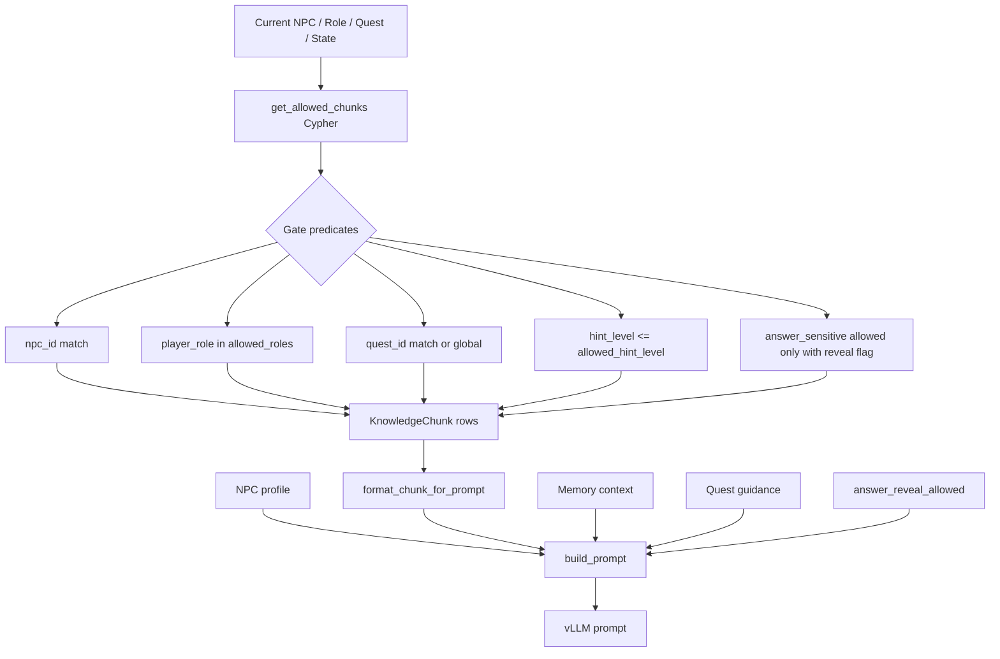
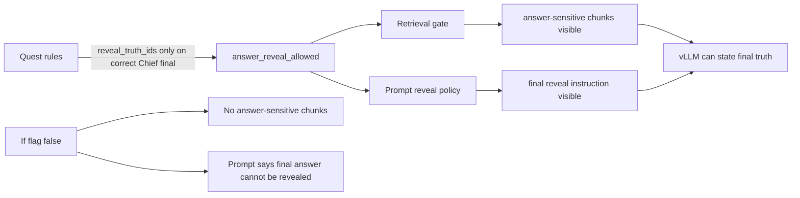
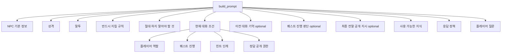
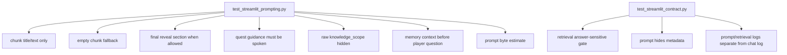

# 07. Prompting And Retrieval

## 한 줄 요약

Prompting layer는 Neo4j에서 이미 gate된 `KnowledgeChunk`와 LangGraph `QuestDecision.guidance`를 합쳐 NPC가 말해도 되는 정보만 자연스러운 한국어 대사로 답하게 만드는 안전 장치다.

## Retrieval-to-prompt pipeline



Image-generation prompt:

```text
Create a GraphRAG prompt pipeline image. Show symbolic retrieval gates before prompt construction. Highlight that answer-sensitive chunks require both answer_reveal_allowed and ready/solved quest state. Show NPC profile, memory, quest guidance, and chunks joining in build_prompt.
```

## Retrieval gate contract

File: `src/streamlit/test_app.py#get_allowed_chunks`  
Purpose: 현재 대화 조건에 허용된 chunk만 prompt로 넘긴다.  
Invariant: `answer_sensitive`는 reveal flag와 quest state 둘 다 만족해야 retrieval된다.

```python
def get_allowed_chunks(
    npc_id: str,
    player_role: str,
    quest_id: str | None,
    quest_state: str,
    allowed_hint_level: int,
    answer_reveal_allowed: bool,
    limit: int = 8,
) -> list[dict[str, object]]:
    query = """
    MATCH (:NPC {npc_id: $npc_id})-[:KNOWS]->(k:KnowledgeChunk)
    WHERE
      ($quest_id IS NULL OR k.quest_id = $quest_id OR k.quest_id IS NULL)
      AND $player_role IN k.allowed_roles
      AND k.hint_level <= $allowed_hint_level
      AND (k.answer_sensitive = false OR ($answer_reveal_allowed = true AND $quest_state IN ["ready_to_answer", "solved"]))
    RETURN
      k.chunk_id AS chunk_id,
      k.title AS title,
      k.knowledge_type AS knowledge_type,
      k.quest_id AS quest_id,
      k.hint_level AS hint_level,
      k.answer_sensitive AS answer_sensitive,
      k.text AS text
    ORDER BY
      CASE WHEN k.quest_id = $quest_id THEN 0 ELSE 1 END,
      k.hint_level DESC,
      k.chunk_id ASC
    LIMIT $limit
    """
```

작은 기능별 설명:

- `MATCH (:NPC)-[:KNOWS]->(k)`로 현재 NPC가 아는 chunk에서 시작한다.
- `quest_id`가 같은 chunk를 우선 사용하고, `k.quest_id IS NULL`인 global chunk도 허용한다.
- `player_role IN k.allowed_roles`로 역할별 정보 제한을 건다.
- `hint_level <= allowed_hint_level`이 현재 진행도보다 높은 힌트를 차단한다.
- `answer_sensitive = true`는 final reveal 조건에서만 열린다.
- `ORDER BY CASE WHEN k.quest_id = $quest_id THEN 0 ELSE 1 END`로 quest-specific chunk가 global chunk보다 먼저 온다.
- `LIMIT 8`은 prompt context 폭주를 막는다.

## Answer reveal safety layers



Image-generation prompt:

```text
Create a layered safety diagram for final answer reveal. Show three layers: quest rules produce reveal flag, retrieval gate opens answer-sensitive chunks, prompt policy explicitly permits or forbids final answer. Use red locks for false path and green unlocks for true path.
```

Runtime calculation:

```python
answer_reveal_allowed = bool(quest_decision.reveal_truth_ids) or (
    st.session_state.npc_id == CHIEF_NPC_ID
    and st.session_state.quest_state == "solved"
)
```

설명:

- `quest_decision.reveal_truth_ids`가 있으면 quest rules가 최종 공개를 허용한 것이다.
- 이미 로완이 `solved` 상태라면 후속 질문에서도 solved state에 맞춰 공개 가능하다.
- 이 flag는 retrieval query와 `build_prompt` 양쪽에 전달된다.

## Chunk formatting policy

File: `src/streamlit/prompting.py#format_chunk_for_prompt`  
Purpose: prompt에 chunk metadata를 노출하지 않고 제목/본문만 넣는다.  
Invariant: `chunk_id`, `knowledge_type`, `hint_level`, `answer_sensitive` 같은 내부 label은 prompt 본문에 쓰지 않는다.

```python
def format_chunk_for_prompt(chunk: dict[str, object]) -> str:
    title = chunk.get("title")
    text = chunk.get("text")

    if isinstance(title, str) and title.strip():
        return f"참고 제목: {title}\n참고 내용:\n{text}"

    return f"참고 내용:\n{text}"
```

이유:

- NPC 대사에서 `KnowledgeChunk`, `chunk_id`, `answer_sensitive` 같은 메타 용어가 나오지 않게 한다.
- LLM은 제목과 본문만 보고 자연어 응답을 만든다.
- QA에서 prompt가 내부 식별자를 노출하지 않는지 검사한다.

## Prompt section structure



Image-generation prompt:

```text
Create a prompt anatomy image. Use stacked sections in order: NPC info, personality, speech style, must rules, must-not rules, current conversation conditions, optional memory, optional quest guidance, optional final reveal instruction, available knowledge, response policy, player question. Indicate optional sections with dashed outlines.
```

핵심 코드:

```python
def build_prompt(
    npc: dict[str, object],
    chunks: list[dict[str, object]],
    user_message: str,
    quest_state: str,
    player_role: str,
    allowed_hint_level: int,
    conversation_context: str = "",
    quest_guidance: str = "",
    answer_reveal_allowed: bool = False,
) -> str:
    chunk_text = "\n\n".join(format_chunk_for_prompt(chunk) for chunk in chunks)

    if not chunk_text:
        chunk_text = "사용 가능한 지식이 없습니다."

    npc_role = display_label(npc.get("role"), ROLE_LABELS)
    player_role_label = display_label(player_role, ROLE_LABELS)
    quest_state_label = display_label(quest_state, QUEST_STATE_LABELS)
```

설명:

- `ROLE_LABELS`, `QUEST_STATE_LABELS`로 영어 enum을 한국어 label로 바꾼다.
- chunk가 없으면 LLM에게 “사용 가능한 지식이 없습니다”라고 명시한다.
- `conversation_context`, `quest_guidance`, `answer_reveal_allowed`는 optional section을 만든다.

## Memory context section

File: `src/streamlit/prompting.py#format_memory_context`  
Purpose: 세션 요약과 최근 대화를 prompt 안에 넣는다.  
Invariant: memory context에는 policy prompt를 반복하지 않는다.

```python
def format_memory_context(summary: str, recent_turns: Sequence[Mapping[str, object]]) -> str:
    parts: list[str] = []
    clean_summary = summary.strip()
    if clean_summary:
        parts.append(clean_summary)

    recent_lines: list[str] = []
    for turn in recent_turns:
        speaker = str(turn.get("speaker_label", "알 수 없음")).strip() or "알 수 없음"
        content = str(turn.get("content", "")).strip()
        if content:
            recent_lines.append(f"{speaker}: {content}")

    if recent_lines:
        parts.append("최근 대화:\n" + "\n".join(recent_lines))

    return "\n\n".join(parts)
```

Prompt insertion:

```python
if conversation_context.strip():
    memory_section = f"""

[이전 대화 기억]
{conversation_context.strip()}
"""
```

## Quest guidance section

File: `src/streamlit/prompting.py#build_prompt`  
Purpose: LangGraph decision을 NPC 대사 안에 강하게 반영한다.  
Invariant: route 안내나 부족한 단서 안내가 decision에 있으면 NPC 답변 본문에 자연어로 포함되어야 한다.

```python
if quest_guidance.strip():
    quest_guidance_section = f"""

[퀘스트 진행 판단]
{quest_guidance.strip()}
위 판단에 특정 NPC, 퀘스트 이름, 남은 단서, 이동 안내가 들어 있으면 NPC 응답 본문에 반드시 자연스러운 한국어로 직접 말해라.
위 판단이 최종 정답을 인정하지 말라고 하면 정답을 암시하지 말고, 어디에서 무엇을 확인해야 하는지 명확히 말해라.
"답변에 반드시 포함"이라고 적힌 문장은 이번 NPC 응답에 거의 그대로 포함해라.
"""
```

이 section이 해결하는 문제:

- 모델이 partial final 상황에서 “맞는 것 같군”처럼 애매하게 답하는 것을 막는다.
- route target NPC와 남은 단서를 답변에 직접 말하게 한다.
- QA에서 로완 partial 답변이 최종 정답을 누설하지 않고 리오/표지판/뿌리 자국으로 되돌리는지 검증한다.

## Final reveal section

File: `src/streamlit/prompting.py#build_prompt`  
Purpose: solved final state에서 LLM이 답을 미루지 않고 전말을 직접 말하게 한다.  
Invariant: `answer_reveal_allowed`가 true이고 `quest_state == "solved"`일 때만 section이 들어간다.

```python
if answer_reveal_allowed and quest_state == "solved":
    final_reveal_section = """

[최종 전말 공개 지시]
플레이어의 최종 추리는 이미 정답으로 판정되었다.
첫 문장부터 전말을 확정해 말해라.
달빛 샘터의 마나 주기 강화가 원인이라고 직접 말해라.
사용 가능한 지식에 있는 최종 원인 이름과 사건 연결고리를 생략하지 마라.
버섯 빛, 말랑돼지 발자국, 방울젤리 색 변화, 표지판 흔적을 모두 연결해 말해라.
민민 부인, 순찰대장 리오, 마도사 루미의 보고가 어떻게 이어지는지 종합해 말해라.
되묻거나 추가 확인을 요구하지 마라.
플레이어에게 스스로 정리하라고 말하지 마라.
"""
```

시각화 포인트:

- final reveal section은 “green unlock”처럼 표현한다.
- section이 없을 때는 prompt policy가 final answer를 금지한다.
- section이 있을 때는 “첫 문장부터 전말 확정”이 핵심이다.

## Response policy

File: `src/streamlit/prompting.py#build_prompt`  
Purpose: 모든 답변에 적용되는 일반 정책이다.

```text
[응답 정책]
- 사용 가능한 지식에 없는 사실을 새로 만들지 마라.
- NPC가 모르는 내용은 모른다고 말해라.
- 정답 공개 권한이 불가이면 quest_state가 ready_to_answer 또는 solved여도 최종 정답을 말하지 말고 힌트나 이동 안내만 줘라.
- 정답 공개 권한이 허용이고 퀘스트 진행이 해결됨이면 반드시 최종 전말, 단서 연결고리와 해결 인정을 직접 말해라. 되묻거나 추가 확인을 요구하지 마라.
- 최종 전말 공개가 허용된 상태에서는 "스스로 정리", "다시 확인", "더 조사"처럼 답을 미루는 표현을 쓰지 마라.
- 퀘스트 진행 판단에 필수 포함 문장이 있으면 추상적으로 바꾸지 말고 NPC 말투로 그대로 전달해라.
- 정답 공개 권한이 허용일 때만 퀘스트의 최종 전말과 해결 인정을 말할 수 있다.
- 답변은 반드시 NPC의 말투로 작성해라.
- 시스템, 데이터베이스, RAG, chunk, 권한 같은 메타 용어를 게임 캐릭터 입장에서 말하지 마라.
- 내부 식별자, 영어 데이터 라벨, 지식 분류명은 답변에 쓰지 말고 자연스러운 한국어 대사로 바꿔라.
- 이전 답변과 같은 표현을 반복하지 말고, 사용 가능한 지식 중 플레이어 질문에 맞는 구체 정보를 골라 답해라.
- 답변은 2~5문장으로 작성해라.
- 한국어로 답해라.
```

## Prompt quality tests



Image-generation prompt:

```text
Create a test coverage image for prompt and retrieval. Show two suites: prompt unit tests and Streamlit contract tests. Connect them to protected contracts: hidden metadata, final reveal gating, memory context, retrieval gate, and split logs.
```

Representative tests:

```python
def test_format_chunk_for_prompt_uses_title_and_text_only(self):
    chunk = {
        "chunk_id": "secret_chunk_id",
        "title": "버섯 관찰",
        "knowledge_type": "observation",
        "hint_level": 2,
        "answer_sensitive": True,
        "text": "달빛 아래에서만 버섯이 밝게 보였다.",
    }

    formatted = format_chunk_for_prompt(chunk)

    self.assertIn("참고 제목: 버섯 관찰", formatted)
    self.assertNotIn("secret_chunk_id", formatted)
    self.assertNotIn("answer_sensitive", formatted)
```

```python
def test_build_prompt_requires_explicit_final_reveal_when_allowed(self):
    prompt = build_prompt(... quest_state="solved", answer_reveal_allowed=True)

    self.assertIn("정답 공개 권한: 허용", prompt)
    self.assertIn("[최종 전말 공개 지시]", prompt)
    self.assertIn("달빛 샘터의 마나 주기 강화가 원인이라고 직접 말해라", prompt)
```

## QA scenario retrieval mirror

File: `test_script/run_quest_scenario_quality.py#allowed_chunks`  
Purpose: live QA에서도 앱과 같은 retrieval gate를 사용한다.

```python
def allowed_chunks(
    npc_id: str,
    player_role: str,
    quest_id: str,
    quest_state: str,
    allowed_hint_level: int,
    answer_reveal_allowed: bool,
) -> list[dict[str, object]]:
    return query_neo4j(
        """
        MATCH (:NPC {npc_id: $npc_id})-[:KNOWS]->(k:KnowledgeChunk)
        WHERE ($quest_id IS NULL OR k.quest_id = $quest_id OR k.quest_id IS NULL)
          AND $player_role IN k.allowed_roles
          AND k.hint_level <= $allowed_hint_level
          AND (k.answer_sensitive = false OR ($answer_reveal_allowed = true AND $quest_state IN ["ready_to_answer", "solved"]))
        RETURN k.chunk_id AS chunk_id, k.title AS title, k.quest_id AS quest_id,
               k.hint_level AS hint_level, k.answer_sensitive AS answer_sensitive, k.text AS text
        ORDER BY CASE WHEN k.quest_id = $quest_id THEN 0 ELSE 1 END, k.hint_level DESC, k.chunk_id ASC
        LIMIT 8
        """,
        {...},
    )
```

인수인계 의미:

- 앱 runtime과 QA script가 같은 gate를 사용한다.
- QA는 answer-sensitive chunk가 final 전에는 검색되지 않는지 직접 확인한다.
- final turn에서는 answer-sensitive chunk가 실제로 retrieval되는지 확인한다.

## 인수인계 포인트

- retrieval gate와 prompt policy는 둘 중 하나만으로 충분하지 않다. 둘 다 있어야 한다.
- `format_chunk_for_prompt`에 metadata를 추가하면 NPC가 내부 식별자를 말할 위험이 있다.
- `quest_guidance`는 단순 debug가 아니라 LLM 행동 제어 prompt다.
- final reveal prompt는 “답을 미루지 말라”는 negative policy를 포함해야 한다.
- 새 `KnowledgeChunk`를 추가할 때 `allowed_roles`, `hint_level`, `answer_sensitive`를 잘못 주면 prompt 안전성이 깨진다.
