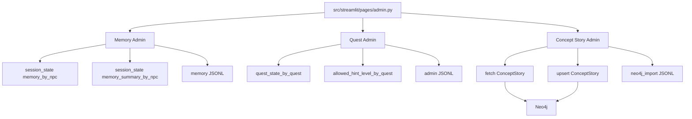
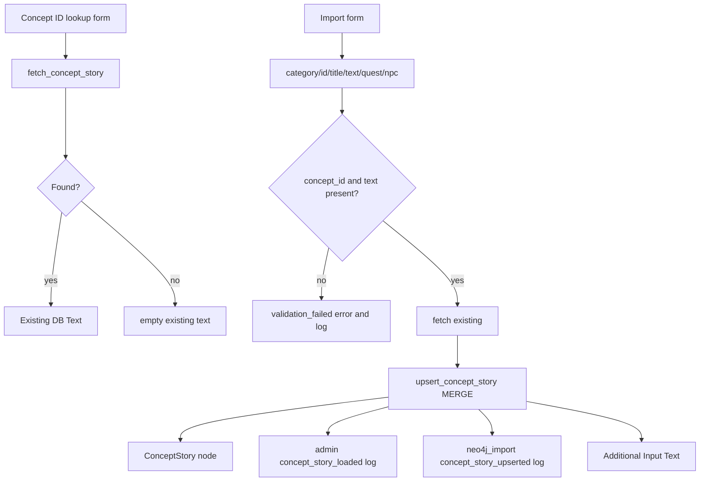
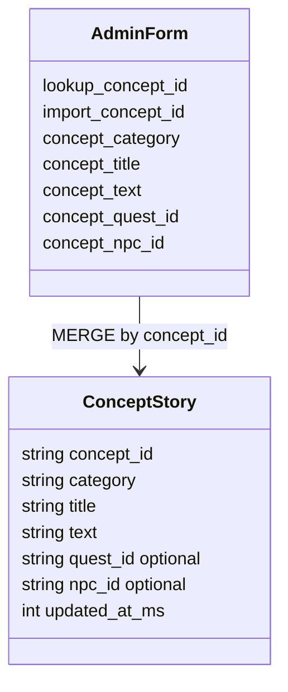
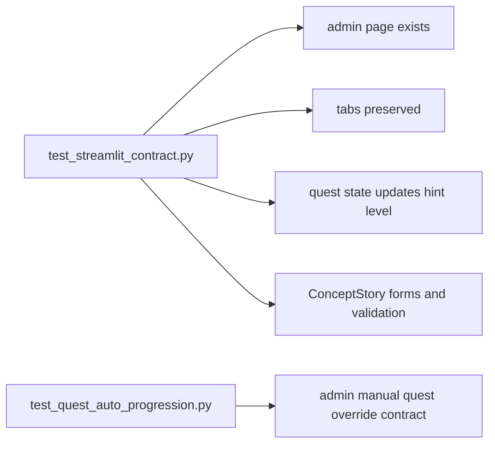

# 08. Admin UI

## 한 줄 요약

Admin UI는 메인 NPC 채팅 화면과 분리된 Streamlit page로, 세션 메모리 설정, quest state 수동 override, `ConceptStory` Neo4j upsert를 담당한다.

## Admin page overview



Image-generation prompt:

```text
Create an admin dashboard architecture image. Show three tabs: Memory Admin, Quest Admin, Concept Story Admin. Memory and Quest operate on Streamlit session_state, while ConceptStory reads/writes Neo4j. Show separate JSONL logs for memory, admin, and neo4j_import.
```

## Page and config contract

File: `src/streamlit/pages/admin.py`  
Purpose: Streamlit multipage app의 별도 Admin page다.  
Invariant: 메인 chat page에는 `Memory Admin`, `Quest Admin`, `Concept Story Admin` 탭이 없다.

```python
st.set_page_config(page_title="persona admin")
st.title("persona_chat admin")
st.caption("대화 메모리는 세션 상태로만 관리하고, ConceptStory 적재는 별도 Neo4j 노드로만 처리합니다.")

ensure_admin_session_state()

memory_tab, quest_tab, concept_story_tab = st.tabs(["Memory Admin", "Quest Admin", "Concept Story Admin"])
```

환경값:

```python
NEO4J_URI = os.getenv("NEO4J_URI", "bolt://localhost:7687")
NEO4J_USER = os.getenv("NEO4J_USER", "neo4j")
NEO4J_PASSWORD = os.getenv("NEO4J_PASSWORD", "admin2026")

ADMIN_LOG_PATH = Path(os.getenv("ADMIN_LOG_PATH", "output/reports/streamlit_admin_events.jsonl"))
MEMORY_LOG_PATH = Path(os.getenv("MEMORY_LOG_PATH", "output/reports/streamlit_memory_events.jsonl"))
NEO4J_IMPORT_LOG_PATH = Path(os.getenv("NEO4J_IMPORT_LOG_PATH", "output/reports/streamlit_neo4j_import_events.jsonl"))
```

## Admin session state initialization

File: `src/streamlit/pages/admin.py#ensure_admin_session_state`  
Purpose: Admin page가 메인 chat page와 같은 session key 계약을 사용하게 만든다.  
Invariant: 없는 key만 초기화하고, 이미 있는 runtime state는 보존한다.

```python
def ensure_admin_session_state() -> None:
    if "memory_by_npc" not in st.session_state:
        st.session_state.memory_by_npc = {npc_id: [] for npc_id in NPC_OPTIONS}
    if "memory_summary_by_npc" not in st.session_state:
        st.session_state.memory_summary_by_npc = {npc_id: "" for npc_id in NPC_OPTIONS}
    if "max_memory_count_by_npc" not in st.session_state:
        st.session_state.max_memory_count_by_npc = {
            npc_id: DEFAULT_MAX_MEMORY_COUNT for npc_id in NPC_OPTIONS
        }
    if "quest_state_by_quest" not in st.session_state:
        st.session_state.quest_state_by_quest = {
            quest_id: DEFAULT_QUEST_STATE for quest_id in QUEST_OPTIONS
        }
    if "allowed_hint_level_by_quest" not in st.session_state:
        st.session_state.allowed_hint_level_by_quest = {
            quest_id: hint_level_for_quest_state(st.session_state.quest_state_by_quest[quest_id])
            for quest_id in QUEST_OPTIONS
        }
```

시각화 포인트:

- Admin은 별도 page지만 같은 browser session의 `st.session_state`를 본다.
- 메모리와 quest state는 DB가 아니라 session memory다.
- ConceptStory만 Neo4j에 쓴다.

## Feature log router

File: `src/streamlit/pages/admin.py#append_feature_log`  
Purpose: Admin action 로그를 concern별 JSONL로 분리한다.  
Invariant: 모든 Admin log record에는 `timestamp_ms`가 붙는다.

```python
def append_jsonl(path: Path, record: dict[str, object]) -> None:
    path.parent.mkdir(parents=True, exist_ok=True)
    record_with_timestamp = {"timestamp_ms": current_timestamp_ms(), **record}
    with path.open("a", encoding="utf-8") as log_file:
        log_file.write(json.dumps(record_with_timestamp, ensure_ascii=False) + "\n")


def append_feature_log(category: str, record: dict[str, object]) -> None:
    if category == "memory":
        append_jsonl(MEMORY_LOG_PATH, record)
        return
    if category == "neo4j_import":
        append_jsonl(NEO4J_IMPORT_LOG_PATH, record)
        return
    append_jsonl(ADMIN_LOG_PATH, {"category": category, **record})
```

## Memory Admin flow

```mermaid
flowchart TD
    A[Select NPC Memory Target] --> B[Set Max Memory Count]
    B --> C[Save Memory Setting]
    C --> D[max_memory_count_by_npc[npc_id]]
    C --> E[memory_setting_saved log]
    A --> F[선택 NPC 메모리 초기화]
    F --> G[memory_by_npc[npc_id] = []]
    F --> H[memory_summary_by_npc[npc_id] = empty]
    F --> I[memory_cleared log]
    D --> J[Current Summary read-only]
    H --> J
```

Image-generation prompt:

```text
Create a Memory Admin flow image. Show selecting an NPC, saving max memory count, clearing selected NPC memory, and viewing current summary. Label all storage as session_state only, not Neo4j.
```

핵심 코드:

```python
with memory_tab:
    st.subheader("Memory Admin")
    with st.form("memory_admin_form"):
        memory_npc_id = st.selectbox(
            "NPC Memory Target",
            NPC_OPTIONS,
            format_func=lambda npc_id: str(NPC_NAMES.get(str(npc_id), str(npc_id))),
        )
        max_memory_count = st.number_input(
            "Max Memory Count",
            min_value=10,
            max_value=200,
            step=10,
            value=int(st.session_state.max_memory_count_by_npc.get(memory_npc_id, DEFAULT_MAX_MEMORY_COUNT)),
        )
        save_memory = st.form_submit_button("Save Memory Setting")

    if save_memory:
        st.session_state.max_memory_count_by_npc[memory_npc_id] = int(max_memory_count)
        append_feature_log("memory", {"event": "memory_setting_saved", "npc_id": memory_npc_id, "max_memory_count": int(max_memory_count)})
```

설명:

- memory target은 `NPC_OPTIONS`에서 고른다.
- `Max Memory Count`는 10부터 200까지 10 단위다.
- 저장 시 즉시 session state에 반영된다.
- 메모리 초기화는 선택 NPC 하나만 대상으로 한다.

## Quest Admin flow

```mermaid
flowchart TD
    A[Select Quest] --> B[Select Quest State]
    B --> C[hint_level_for_quest_state]
    C --> D[Metric Allowed Hint Level]
    C --> E[Progress bar]
    B --> F[Save Quest State]
    F --> G[quest_state_by_quest[quest_id]]
    F --> H[allowed_hint_level_by_quest[quest_id]]
    F --> I{Current chat quest?}
    I -- yes --> J[quest_state and allowed_hint_level current controls]
    I -- no --> K[only per-quest maps]
    F --> L[quest_state_saved log]
```

Image-generation prompt:

```text
Create a Quest Admin state override image. Show Quest selection, Quest State selection, automatic hint level calculation, metric/progress display, and save action updating per-quest maps. Emphasize no independent hint slider.
```

핵심 코드:

```python
with quest_tab:
    st.subheader("Quest Admin")
    admin_quest_id = st.selectbox("Quest", QUEST_OPTIONS, key="admin_quest_id")
    current_state = st.session_state.quest_state_by_quest.get(admin_quest_id, DEFAULT_QUEST_STATE)
    quest_state = st.selectbox(
        "Quest State",
        QUEST_STATE_OPTIONS,
        index=QUEST_STATE_OPTIONS.index(current_state),
        key=f"admin_quest_state_{admin_quest_id}",
    )
    linked_hint_level = hint_level_for_quest_state(quest_state)
    st.metric("Allowed Hint Level", linked_hint_level)
    st.progress(linked_hint_level / 3, text=f"Allowed Hint Level: {linked_hint_level}")
    save_quest = st.button("Save Quest State")

    if save_quest:
        st.session_state.quest_state_by_quest[admin_quest_id] = quest_state
        st.session_state.allowed_hint_level_by_quest[admin_quest_id] = linked_hint_level
        if st.session_state.get("quest_id") == admin_quest_id:
            st.session_state.quest_state = quest_state
            st.session_state.allowed_hint_level = linked_hint_level
```

중요 계약:

- hint level은 직접 슬라이더로 정하지 않는다.
- `QUEST_STATE_HINT_LEVELS`에서 state에 맞춰 자동 계산한다.
- 현재 chat page가 같은 quest를 보고 있으면 current controls도 같이 갱신한다.
- 다른 quest면 map만 갱신된다.

## Concept Story Admin flow



Image-generation prompt:

```text
Create a Concept Story Admin flow image. Show lookup form reading existing ConceptStory and import form validating concept_id/text before MERGE. Include optional Quest and NPC links as properties, not relationships. Show two logs: admin and neo4j_import.
```

Fetch code:

```python
def fetch_concept_story(concept_id: str) -> dict[str, object] | None:
    query = """
    MATCH (c:ConceptStory {concept_id: $concept_id})
    RETURN
      c.concept_id AS concept_id,
      c.category AS category,
      c.title AS title,
      c.text AS text,
      c.quest_id AS quest_id,
      c.npc_id AS npc_id,
      c.updated_at_ms AS updated_at_ms
    """

    driver = get_neo4j_driver()
    records, _, _ = driver.execute_query(query, concept_id=concept_id)
    if not records:
        return None
    return records[0].data()
```

Upsert code:

```python
def upsert_concept_story(
    concept_id: str,
    category: str,
    title: str,
    text: str,
    quest_id: str | None,
    npc_id: str | None,
) -> None:
    query = """
    MERGE (c:ConceptStory {concept_id: $concept_id})
    SET
      c.category = $category,
      c.title = $title,
      c.text = $text,
      c.quest_id = $quest_id,
      c.npc_id = $npc_id,
      c.updated_at_ms = $updated_at_ms
    """
```

Form validation:

```python
if submitted:
    clean_concept_id = concept_id.strip()
    clean_concept_text = concept_text.strip()
    if not clean_concept_id or not clean_concept_text:
        st.error("Concept ID and Story / Concept Text are required.")
        append_feature_log(
            "admin",
            {
                "event": "concept_story_validation_failed",
                "concept_id": clean_concept_id,
                "has_text": bool(clean_concept_text),
            },
        )
    else:
        ...
        upsert_concept_story(...)
```

세부 설명:

- `ConceptStory`는 `concept_id` 기준 `MERGE`다.
- `quest_id`, `npc_id`는 optional property다.
- 빈 concept id나 빈 text는 DB에 쓰지 않는다.
- lookup과 import form이 분리되어 있다.
- `Existing DB Text`와 `Additional Input Text`는 read-only display다.

## ConceptStory graph shape



Image-generation prompt:

```text
Create a class card for ConceptStory with all properties. Draw an AdminForm card that maps form fields into ConceptStory. Use a MERGE by concept_id arrow.
```

## Admin tests



Image-generation prompt:

```text
Create a contract-test map for Admin UI. Show tests protecting page separation, tab names, quest state and hint synchronization, ConceptStory validation, and optional Quest/NPC selectbox shape.
```

Representative test checks:

```python
self.assertIn('st.tabs(["Memory Admin", "Quest Admin", "Concept Story Admin"])', admin_source)
self.assertIn("st.session_state.quest_state_by_quest[admin_quest_id] = quest_state", admin_source)
self.assertIn("st.session_state.allowed_hint_level_by_quest[admin_quest_id] = linked_hint_level", admin_source)
self.assertIn("MERGE (c:ConceptStory {concept_id: $concept_id})", admin_source)
self.assertIn('st.form_submit_button("Load Concept Story to Neo4j")', admin_source)
self.assertIn('st.error("Concept ID and Story / Concept Text are required.")', admin_source)
```

## 인수인계 포인트

- Admin 메모리는 session-only다. Chat memory를 Neo4j에 저장하지 않는다.
- Quest Admin은 수동 override 도구다. 정상 runtime progression은 LangGraph가 한다.
- ConceptStory는 현재 일반 NPC retrieval query에 포함되지 않는다. 별도 admin-loaded concept node다.
- Admin page의 optional quest/npc selectbox는 `['', *QUEST_OPTIONS]`, `['', *NPC_OPTIONS]` 형태를 유지한다.
- Neo4j destructive reset 기능은 Admin page에 없다. DB 초기화는 별도 승인된 import/reset 절차에서만 다룬다.
