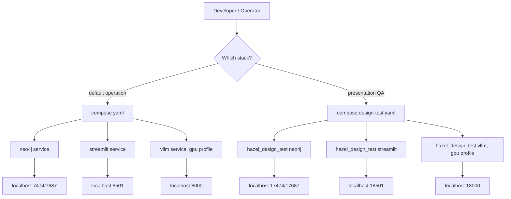
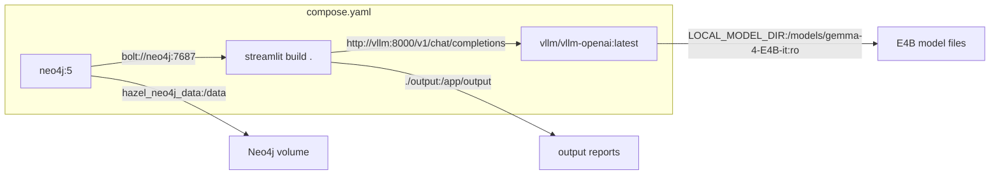
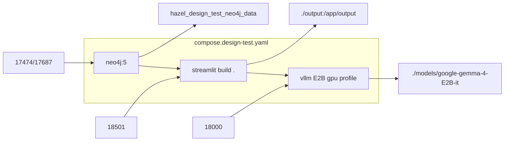
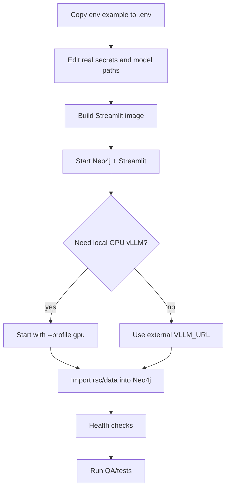
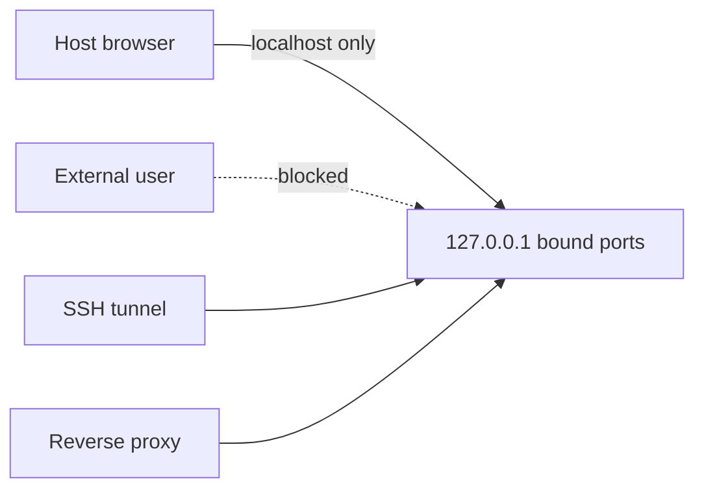

# 09. Docker And Deployment

## 한 줄 요약

Docker 구성은 기본 운영/로컬용 `compose.yaml`과 발표/검증용 isolated `compose.design-test.yaml`로 나뉜다. 두 stack 모두 Neo4j, Streamlit, optional GPU vLLM을 제공하지만 포트, 모델, volume 이름이 다르다.

## Deployment topology



Image-generation prompt:

```text
Create a deployment comparison image with two columns: default compose and design-test compose. Show Neo4j, Streamlit, and optional vLLM in both columns. Highlight different ports, different model defaults, and isolated design-test volume/project name.
```

## Stack comparison

| 항목 | `compose.yaml` | `compose.design-test.yaml` |
|---|---|---|
| 목적 | 기본 로컬/운영 실행 | 발표/검증용 격리 stack |
| Compose project name | 기본 디렉터리 이름 | `hazel_design_test` |
| Streamlit port | `127.0.0.1:8501:8501` | `127.0.0.1:18501:8501` |
| Neo4j HTTP/Bolt | `127.0.0.1:7474`, `127.0.0.1:7687` | `127.0.0.1:17474`, `127.0.0.1:17687` |
| vLLM port | `127.0.0.1:8000:8000` | `127.0.0.1:18000:8000` |
| default model | `google/gemma-4-E4B-it` | `google/gemma-4-E2B-it` |
| model mount | `./models/google-gemma-4-E4B-it` | `./models/google-gemma-4-E2B-it` |
| max model len | `4096` | `3072` |
| Neo4j volume | `hazel_neo4j_data` | `hazel_design_test_neo4j_data` |
| vLLM profile | `gpu` | `gpu` |

## Dockerfile runtime image

File: `Dockerfile`  
Purpose: Streamlit app container를 `uv` 기반 Python 3.10 slim image로 빌드한다.  
Invariant: app entrypoint는 `src/streamlit/test_app.py`다.

```dockerfile
FROM ghcr.io/astral-sh/uv:python3.10-bookworm-slim

ENV PYTHONDONTWRITEBYTECODE=1 \
    PYTHONUNBUFFERED=1 \
    UV_COMPILE_BYTECODE=1 \
    UV_LINK_MODE=copy

WORKDIR /app

COPY pyproject.toml uv.lock README.md ./
RUN uv sync --frozen --no-dev

COPY . .

ENV PYTHONPATH=/app

EXPOSE 8501

HEALTHCHECK --interval=30s --timeout=10s --retries=3 CMD python -c "import urllib.request; urllib.request.urlopen('http://127.0.0.1:8501/_stcore/health', timeout=5)"

CMD ["uv", "run", "--frozen", "streamlit", "run", "src/streamlit/test_app.py", "--server.address=0.0.0.0", "--server.port=8501"]
```

세부 설명:

- dependency layer를 먼저 만들기 위해 `pyproject.toml`, `uv.lock`, `README.md`를 먼저 복사한다.
- `uv sync --frozen --no-dev`로 lockfile 기준 runtime dependency만 설치한다.
- `PYTHONPATH=/app`은 `src.streamlit.*` import를 container 안에서 안정화한다.
- container 내부 healthcheck는 Streamlit의 `/_stcore/health`를 사용한다.

## Python dependency surface

File: `pyproject.toml`  
Purpose: runtime dependency 최소 집합을 정의한다.

```toml
[project]
requires-python = ">=3.10"
dependencies = [
    "langgraph>=1.0.0",
    "neo4j>=6.2.0",
    "python-dotenv>=1.2.1",
    "pyyaml>=6.0.3",
    "requests>=2.34.2",
    "streamlit>=1.57.0",
]
```

역할:

- `streamlit`: chat/admin UI.
- `neo4j`: direct driver access for retrieval/import/admin.
- `requests`: vLLM OpenAI-compatible HTTP calls.
- `langgraph`: quest checkpoint runner.
- `pyyaml`: story YAML loading.
- `python-dotenv`: local scripts/env loading helper.

## Default compose service map



Image-generation prompt:

```text
Create a Docker Compose architecture image for the default stack. Show Neo4j, Streamlit, and optional GPU vLLM. Label internal URLs bolt://neo4j:7687 and http://vllm:8000/v1/chat/completions. Show output bind mount and Neo4j named volume.
```

Key compose excerpt:

```yaml
services:
  neo4j:
    image: neo4j:5
    environment:
      NEO4J_AUTH: ${NEO4J_USER:-neo4j}/${NEO4J_PASSWORD:-admin2026}
    ports:
      - "127.0.0.1:7474:7474"
      - "127.0.0.1:7687:7687"
    volumes:
      - hazel_neo4j_data:/data

  streamlit:
    build: .
    environment:
      NEO4J_URI: bolt://neo4j:7687
      VLLM_URL: ${VLLM_URL:-http://vllm:8000/v1/chat/completions}
      MODEL_NAME: ${MODEL_NAME:-google/gemma-4-E4B-it}
      CHAT_LOG_PATH: ${CHAT_LOG_PATH:-output/reports/streamlit_llm_interactions.jsonl}
    ports:
      - "127.0.0.1:8501:8501"
    volumes:
      - ./output:/app/output
```

## Design-test compose service map



Image-generation prompt:

```text
Create an isolated design-test stack image. Use a separate namespace labeled hazel_design_test. Show ports 18501, 17474, 17687, and 18000. Mark the model as google/gemma-4-E2B-it and the Neo4j volume as separate from default.
```

Key compose excerpt:

```yaml
name: hazel_design_test

services:
  neo4j:
    image: neo4j:5
    ports:
      - "127.0.0.1:17474:7474"
      - "127.0.0.1:17687:7687"
    volumes:
      - hazel_design_test_neo4j_data:/data

  streamlit:
    build: .
    environment:
      NEO4J_URI: bolt://neo4j:7687
      VLLM_URL: ${VLLM_URL:-http://vllm:8000/v1/chat/completions}
      MODEL_NAME: ${MODEL_NAME:-google/gemma-4-E2B-it}
    ports:
      - "127.0.0.1:18501:8501"

  vllm:
    profiles:
      - gpu
    command:
      - --model
      - /models/gemma-4-E2B-it
      - --served-model-name
      - ${VLLM_MODEL:-google/gemma-4-E2B-it}
      - --max-model-len
      - ${VLLM_MAX_MODEL_LEN:-3072}
    ports:
      - "127.0.0.1:18000:8000"
```

## Environment files

Default `.env.example`:

```env
NEO4J_USER=neo4j
NEO4J_PASSWORD=admin2026
NEO4J_URI=bolt://neo4j:7687
NEO4J_DATABASE=neo4j

VLLM_MODEL=google/gemma-4-E4B-it
MODEL_NAME=google/gemma-4-E4B-it
VLLM_URL=http://vllm:8000/v1/chat/completions
CHAT_LOG_PATH=output/reports/streamlit_llm_interactions.jsonl
LOCAL_MODEL_DIR=./models/google-gemma-4-E4B-it
VLLM_GPU_MEMORY_UTILIZATION=0.9
VLLM_MAX_MODEL_LEN=4096
```

Design-test `.env.design-test.example`:

```env
NEO4J_USER=neo4j
NEO4J_PASSWORD=admin2026
NEO4J_URI=bolt://neo4j:7687
NEO4J_DATABASE=neo4j

VLLM_MODEL=google/gemma-4-E2B-it
MODEL_NAME=google/gemma-4-E2B-it
VLLM_URL=http://vllm:8000/v1/chat/completions
CHAT_LOG_PATH=output/reports/streamlit_llm_interactions.jsonl
LOCAL_MODEL_DIR=./models/google-gemma-4-E2B-it
VLLM_GPU_MEMORY_UTILIZATION=0.82
VLLM_MAX_MODEL_LEN=3072
```

인수인계 주의:

- example 파일의 password는 개발 기본값이다. 실제 운영 비밀은 `.env`에만 둔다.
- `VLLM_MODEL`은 vLLM served model name, `MODEL_NAME`은 Streamlit request payload model name이다. 둘이 맞아야 QA script의 model id check가 통과한다.
- container 내부 URL은 `http://vllm:8000/...`이지만 host에서 QA script를 직접 돌릴 때는 design-test 기준 `http://127.0.0.1:18000/...`를 쓴다.

## Operational command flow



Image-generation prompt:

```text
Create an operator runbook image. Show steps: prepare .env, build image, start services, optionally enable GPU vLLM, import story data, check health, run QA. Include warnings that Neo4j reset and volume deletion require explicit approval.
```

Commands:

```bash
uv sync --frozen
docker compose --env-file .env build streamlit
docker compose --env-file .env up -d neo4j streamlit
docker compose --env-file .env --profile gpu up -d neo4j vllm streamlit
docker compose --env-file .env run --rm streamlit uv run --frozen python src/db_control/import_story_source_to_neo4j.py --source-dir rsc/data
curl http://127.0.0.1:8501/_stcore/health
```

Design-test commands:

```bash
docker compose --env-file .env.design-test.example -f compose.design-test.yaml build streamlit
docker compose --env-file .env.design-test.example -f compose.design-test.yaml --profile gpu up -d neo4j vllm streamlit
curl http://127.0.0.1:18501/_stcore/health
```

## Health checks

| Service | Check | Success |
|---|---|---|
| Streamlit default | `curl http://127.0.0.1:8501/_stcore/health` | `ok` |
| Streamlit design-test | `curl http://127.0.0.1:18501/_stcore/health` | `ok` |
| vLLM default | `GET http://127.0.0.1:8000/health` | HTTP 200 |
| vLLM design-test | `GET http://127.0.0.1:18000/health` | HTTP 200 |
| vLLM models default | `GET http://127.0.0.1:8000/v1/models` | served E4B model |
| vLLM models design-test | `GET http://127.0.0.1:18000/v1/models` | `google/gemma-4-E2B-it` |
| Neo4j | `cypher-shell RETURN 1` healthcheck | healthy |

## Port binding security



Image-generation prompt:

```text
Create a network access image showing all service ports bound to 127.0.0.1. Show external direct access blocked, with SSH tunnel or reverse proxy as the intended external access path.
```

핵심 원칙:

- `compose.yaml`과 `compose.design-test.yaml`은 모두 host binding을 `127.0.0.1`로 제한한다.
- Neo4j HTTP/Bolt 포트는 외부 공개하지 않는 것이 기본이다.
- 외부 브라우저 접근이 필요하면 reverse proxy나 SSH tunnel을 사용한다.

## Build-only prior state note

이 문서 작업 직전 확인된 build/cleanup 상태:

- stopped old containers removed: `npc_persona-neo4j-1`, `npc_persona-streamlit-1`, `npc_persona-vllm-1`.
- default network removed: `npc_persona_default`.
- volumes preserved.
- built image: `npc_persona-streamlit:latest`, image id `a4bde968e447`.
- no containers running after build.

이 note는 작업 이력 설명용이며, 이 문서 작성 과정에서는 Docker container를 새로 실행하지 않았다.

## 인수인계 포인트

- 기본 stack과 design-test stack을 섞지 않는다. 포트와 volume이 다르다.
- vLLM은 `gpu` profile이므로 `up -d neo4j streamlit`만 실행하면 외부 vLLM 또는 별도 vLLM URL이 필요하다.
- Neo4j volume 삭제나 DB reset은 destructive operation이다. 사용자 승인 없이 실행하지 않는다.
- `./output:/app/output` bind mount가 JSONL/report 산출물을 host에 남긴다.
- `.env.example`은 템플릿이다. 실제 secret을 커밋하지 않는다.
