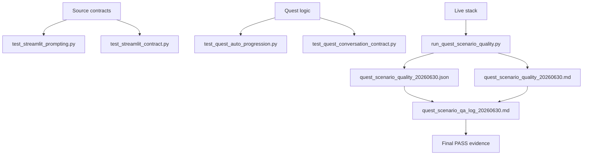
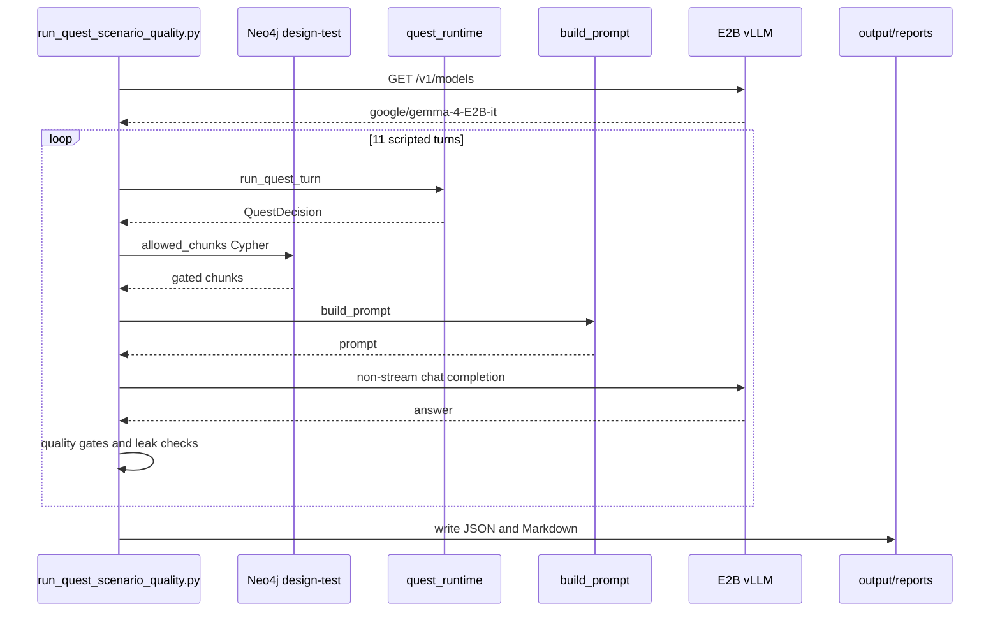
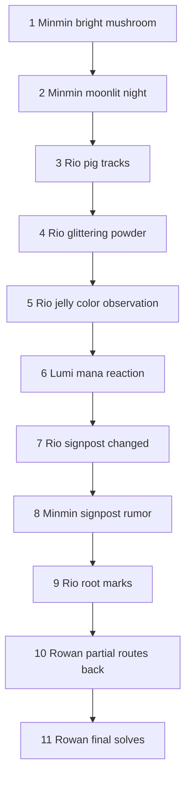
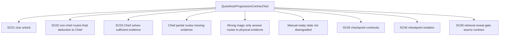

# 10. QA And Test Artifacts

## 한 줄 요약

QA 체계는 단위/계약 테스트로 code-level invariant를 지키고, design-test Docker stack에서 live Neo4j + E2B vLLM 11턴 natural QA로 실제 NPC 답변 품질을 검증한다.

## QA pyramid



Image-generation prompt:

```text
Create a QA pyramid image for Hazel Village GraphRAG. Bottom layer: source contract/unit tests. Middle layer: quest conversation tests. Top layer: live design-test stack QA with Neo4j and E2B vLLM. Show JSON/Markdown artifacts feeding the final Korean QA log.
```

## QA artifact map

| Artifact | 생성/위치 | 역할 |
|---|---|---|
| `test_script/test_streamlit_prompting.py` | source test | prompt formatting, memory, final reveal instruction contract |
| `test_script/test_streamlit_contract.py` | source contract test | Streamlit source, retrieval gate, logging, admin surface, compose contract |
| `test_script/test_quest_auto_progression.py` | source test | clue unlock, route, checkpoint continuity/isolation, admin contract |
| `test_script/test_quest_conversation_contract.py` | source test | multi-quest route chain, 로완 partial/final behavior, chat log contract |
| `test_script/run_quest_scenario_quality.py` | live QA script | Neo4j/vLLM을 실제 호출해 11턴 품질 gate 수행 |
| `output/reports/quest_scenario_quality_20260630.json` | generated evidence | model ids, query, answer, decision, retrieved chunks |
| `output/reports/quest_scenario_quality_20260630.md` | generated evidence | live QA report |
| `docs/npc_persona_version_2/quest_scenario_qa_log_20260630.md` | curated report | 한국어 최종 QA 로그/결론 |

## Live QA environment

File: `docs/npc_persona_version_2/quest_scenario_qa_log_20260630.md`  
Purpose: final QA result를 한국어로 설명한다.

```text
- 실행일: 2026-06-30
- 실행 환경: compose.design-test.yaml + .env.design-test.example
- Streamlit: http://127.0.0.1:18501
- vLLM 모델: google/gemma-4-E2B-it
- Neo4j: hazel_design_test, KnowledgeChunk 30개
- 자동 품질 QA 결과: PASS, 11턴
- 원본 산출물: output/reports/quest_scenario_quality_20260630.md, output/reports/quest_scenario_quality_20260630.json
- 재현 스크립트: test_script/run_quest_scenario_quality.py
```

Chunk distribution evidence:

| NPC | KnowledgeChunk count |
|---|---:|
| `chief_rowan` | 8 |
| `mage_lumi` | 6 |
| `minmin_lady` | 9 |
| `patrol_leader_rio` | 7 |
| Total | 30 |

## Live QA script flow



Image-generation prompt:

```text
Create a sequence diagram image for live QA. The script checks vLLM model id, runs 11 quest turns through quest_runtime, queries Neo4j with the same retrieval gate, builds prompts, calls E2B vLLM, checks quality/leak gates, and writes JSON/Markdown reports.
```

Core script constants:

```python
MODEL_NAME = os.getenv("MODEL_NAME", "google/gemma-4-E2B-it")
VLLM_URL = os.getenv("VLLM_URL", "http://127.0.0.1:18000/v1/chat/completions")
NEO4J_URI = os.getenv("NEO4J_URI", "bolt://127.0.0.1:17687")
REPORT_PATH = Path("output/reports/quest_scenario_quality_20260630.md")
JSON_PATH = Path("output/reports/quest_scenario_quality_20260630.json")
FINAL_SECRET = "달빛 샘터의 마나 주기 강화"
META_WORDS = ("RAG", "chunk", "quest_state", "KnowledgeChunk", "데이터베이스")
FINAL_PUNT_WORDS = ("스스로 정리", "다시 확인", "더 조사", "무엇을 의미하는지")
```

## Quality gate function

File: `test_script/run_quest_scenario_quality.py#run_turn`  
Purpose: 한 turn마다 quest state, retrieval safety, answer content를 동시에 검증한다.  
Invariant: final reveal 전에는 final secret과 answer-sensitive chunks가 없어야 한다.

```python
def run_turn(
    label: str,
    npc_id: str,
    quest_id: str,
    player_role: str,
    message: str,
    expected_state: str,
    quality_groups: tuple[tuple[str, ...], ...],
    override_states: dict[str, str] | None = None,
    override_observed: dict[str, list[str]] | None = None,
) -> dict[str, object]:
    decision = run_quest_turn(...)
    apply_decision_to_maps(decision, active_states, active_levels, active_observed)
    reveal = bool(decision.reveal_truth_ids) or (npc_id == "chief_rowan" and decision.quest_state == "solved")
    chunks = allowed_chunks(npc_id, player_role, quest_id, decision.quest_state, decision.allowed_hint_level, reveal)
    prompt = build_prompt(...)
    answer = ask_model(prompt)
    answer_sensitive_chunks = [str(row["chunk_id"]) for row in chunks if row["answer_sensitive"]]
    require(decision.quest_state == expected_state, f"{label}: expected {expected_state}, got {decision.quest_state}")
    require(answer.strip() != "", f"{label}: empty answer")
    require(not any(word in answer for word in META_WORDS), f"{label}: leaked meta word: {answer}")
    if not reveal:
        require(not answer_sensitive_chunks, f"{label}: retrieved answer-sensitive chunks {answer_sensitive_chunks}")
        require(FINAL_SECRET not in answer, f"{label}: leaked final secret: {answer}")
    require(has_any_group(answer, quality_groups), f"{label}: failed answer quality groups {quality_groups}: {answer}")
```

검증 내용:

- expected quest state와 실제 decision state 일치.
- 응답이 비어 있지 않음.
- `RAG`, `chunk`, `quest_state`, `KnowledgeChunk`, `데이터베이스` 같은 메타어 누출 없음.
- reveal 전에는 answer-sensitive chunk retrieval 없음.
- reveal 전에는 `달빛 샘터의 마나 주기 강화` 직접 누출 없음.
- turn별 품질 키워드 그룹 중 하나를 만족.

## 11-turn scenario map



Image-generation prompt:

```text
Create an 11-step quest QA journey. Use NPC icons or labels for Minmin, Rio, Lumi, and Chief Rowan. Show four pre-final quests becoming ready_to_answer, then Rowan partial blocking missing clue, then Rowan final solved reveal.
```

Scenario code excerpt:

```python
run_turn("minmin-1-bright-mushroom", "minmin_lady", "q_glowing_mushroom", "farmer", "밤에만 눈에 띄는 빛과 주변 가루를 본다. 낮과 밤을 나누어 보렴.", "hint_1_given", ...)
run_turn("minmin-2-moonlit-night", "minmin_lady", "q_glowing_mushroom", "farmer", "민민 부인의 기억이 달 밝은 밤에 집중된다. 달이 밝으면 더 보였단다.", "ready_to_answer", ...)
run_turn("rio-1-pig-tracks", "patrol_leader_rio", "q_pig_escape", "knight", "말랑돼지 발자국이 숲 입구 쪽으로 이어진다. 방향을 봐라.", "hint_1_given", ...)
...
final = run_turn("rowan-final-solves-with-all-ready", "chief_rowan", FINAL_QUEST_ID, "lord", "민민의 달 밝은 밤과 강한 버섯 빛, 리오의 숲 방향 발자국과 가루, 루미의 방울젤리 마나 반응, 표지판 주변의 뿌리 자국까지 모두 합치면 달빛 샘터의 마나 주기 강화가 포자와 생물 반응을 일으킨 것이 정답 아닌가요?", "solved", ...)
```

## Rowan partial/final evidence

Partial gate from final QA report:

```text
- 진행 판정: ready_to_answer
- route: patrol_leader_rio / q_changed_signpost
- 누락 단서: clue_root_marks
- 공개 truth: 없음
- 정답 민감 chunk 노출: 없음
```

Final gate from final QA report:

```text
- 진행 판정: solved
- 공개 truth: truth_moonwell_mana_cycle
- 정답 민감 chunk 노출: rowan_chronicle_005, rowan_chronicle_006, rowan_chronicle_007, rowan_chronicle_001
```

Final NPC answer evidence:

```text
민민 부인의 달 밝은 밤과 버섯 빛, 리오의 숲 방향 발자국과 가루, 그리고 루미의 방울젤리 마나 반응과 표지판 주변의 뿌리 자국까지 모두 종합해 볼 때, 달빛 샘터의 마나 주기 강화가 포자와 생물 반응을 일으킨 것이 맞습니다.
```

## Quest auto progression tests

File: `test_script/test_quest_auto_progression.py`  
Purpose: rules layer와 runtime checkpoint의 핵심 계약을 보호한다.



Image-generation prompt:

```text
Create a unit test coverage diagram for quest progression. Use boxes for clue unlock, route to Chief, Chief solve, partial route, wrong hypothesis, no downgrade, checkpoint continuity, checkpoint isolation, and retrieval reveal gate.
```

Representative test:

```python
def test_sc02_non_chief_routes_final_deduction_to_chief_without_solving(self) -> None:
    context = QuestTurnContext(
        npc_id="minmin_lady",
        quest_id="q_glowing_mushroom",
        user_message="정답은 강하게 빛나는 몽실버섯과 달 밝은 밤이 연결된 원인 같아요.",
        quest_state_by_quest={"q_glowing_mushroom": "ready_to_answer"},
        observed_clue_ids_by_quest={"q_glowing_mushroom": ("clue_bright_mushroom", "clue_moonlit_night")},
    )

    decision = evaluate_quest_turn(self.rule_set, context)

    self.assertEqual(CHIEF_NPC_ID, decision.route_to_npc_id)
    self.assertEqual(FINAL_QUEST_ID, decision.route_to_quest_id)
    self.assertNotEqual("solved", decision.quest_state)
    self.assertEqual((), decision.reveal_truth_ids)
```

## Conversation contract tests

File: `test_script/test_quest_conversation_contract.py`  
Purpose: 여러 quest가 이어지는 실제 대화 순서를 검증한다.

```python
def test_continuous_four_quest_dialogue_routes_until_all_pre_final_quests_ready(self) -> None:
    session_id = uuid4().hex
    tracker = make_tracker()

    run_script_turn(session_id, tracker, QuestScriptTurn("minmin_lady", "q_glowing_mushroom", "밤에만 눈에 띄는 빛과 주변 가루를 본다."))
    run_script_turn(session_id, tracker, QuestScriptTurn("minmin_lady", "q_glowing_mushroom", "민민 부인의 기억이 달 밝은 밤에 집중된다."))
    first_route = run_script_turn(session_id, tracker, QuestScriptTurn(CHIEF_NPC_ID, FINAL_QUEST_ID, "민민 부인에게 빛과 달 밝은 밤 이야기를 들었어요."))
    self.assertEqual("patrol_leader_rio", first_route.route_to_npc_id)
    self.assertEqual("q_pig_escape", first_route.route_to_quest_id)
```

이 suite가 보호하는 것:

- active quest만 진행된다.
- 로완은 다음 필요한 NPC/quest로 순서 있게 route한다.
- 모든 pre-final quest가 `ready_to_answer`가 될 때까지 final answer를 막는다.
- final guidance가 `직접 공개`, 세 NPC 이름, 최종 truth 이름을 포함한다.
- chat JSONL record가 `input`, `output`만 갖는다.

## Streamlit and prompt contract tests

File: `test_script/test_streamlit_contract.py`, `test_script/test_streamlit_prompting.py`  
Purpose: Streamlit source-level contracts와 prompt details를 보호한다.

Protected contracts:

- E4B default model and `admin2026` dev default are source defaults.
- vLLM connection refused error has readable guidance.
- retrieval gate applies hint cap before answer-sensitive gate.
- quest state maps to hint level; no independent hint slider.
- sidebar debug persists outside chat submit.
- prompt hides internal chunk metadata.
- chat log is conversation-only JSONL.
- vLLM HTTP errors do not pollute chat memory.
- response tokens are reserved before context compaction.
- compose files persist `./output:/app/output` and `CHAT_LOG_PATH`.
- NPC selection auto-syncs role and quest.
- Admin controls live on a separate page.
- ConceptStory import is button-driven and validation-protected.

Representative checks:

```python
self.assertIn("AND k.hint_level <= $allowed_hint_level", source)
self.assertIn("$answer_reveal_allowed = true", source)
self.assertIn("$quest_state IN [\"ready_to_answer\", \"solved\"]", source)
```

```python
self.assertIn("[최종 전말 공개 지시]", prompt)
self.assertIn("첫 문장부터 전말을 확정해 말해라", prompt)
self.assertIn("달빛 샘터의 마나 주기 강화가 원인이라고 직접 말해라", prompt)
```

## Reproducibility commands

```bash
uv run --frozen python -m unittest test_script/test_streamlit_prompting.py
uv run --frozen python -m unittest test_script/test_streamlit_contract.py
uv run --frozen python -m unittest test_script/test_quest_auto_progression.py
uv run --frozen python -m unittest test_script/test_quest_conversation_contract.py
```

Live QA requires the design-test stack and loaded Neo4j data:

```bash
docker compose --env-file .env.design-test.example -f compose.design-test.yaml --profile gpu up -d neo4j vllm streamlit
uv run --frozen python src/db_control/import_story_source_to_neo4j.py --source-dir rsc/data --database neo4j
uv run --frozen python test_script/run_quest_scenario_quality.py
```

주의:

- 이 문서 작업 중 live QA를 새로 실행하지 않았다. 위 명령은 재현 절차다.
- design-test stack은 port `18501/18000/17474/17687`을 사용한다.
- QA script는 `/v1/models`가 `google/gemma-4-E2B-it`만 반환한다고 기대한다.

## Final QA conclusion

From `docs/npc_persona_version_2/quest_scenario_qa_log_20260630.md`:

```text
- 민민 부인, 순찰대장 리오, 마법사 루미는 각자 자기 지식 범위 안에서 단계별 단서를 제공했고, 최종 전말은 공개하지 않았다.
- 리오는 네 번째 선행 퀘스트까지 완료되면 로완에게 종합 추리를 제시하도록 유도했다.
- 로완은 단서가 하나라도 부족한 경우 최종 정답을 인정하지 않고 미완료 NPC/퀘스트로 되돌렸다.
- 로완은 모든 선행 NPC 진행 단계가 최종 준비 상태가 되고, 사용자가 전체 정답을 종합해 제시했을 때만 truth_moonwell_mana_cycle과 전체 전말을 공개했다.
- Streamlit Admin 화면에서도 퀘스트 상태 선택과 저장에 따라 hint level이 정상 반영됐다.
```

## 인수인계 포인트

- source tests와 live QA는 서로 대체 관계가 아니다. source tests는 contract drift를 막고, live QA는 실제 모델 답변 품질을 본다.
- final QA artifact는 `output/reports/*`에 있지만 curated Korean report는 `docs/npc_persona_version_2/quest_scenario_qa_log_20260630.md`다.
- QA script의 retrieval query는 app runtime query와 의도적으로 같은 gate를 반복한다.
- answer-sensitive chunk가 final 전에는 없어야 하고, final에는 있어야 한다는 양방향 검증이 핵심이다.
- live QA는 Docker/vLLM/Neo4j 의존성이 있으므로 일반 문서 sanity check와 분리해서 실행한다.
