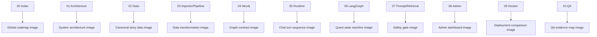
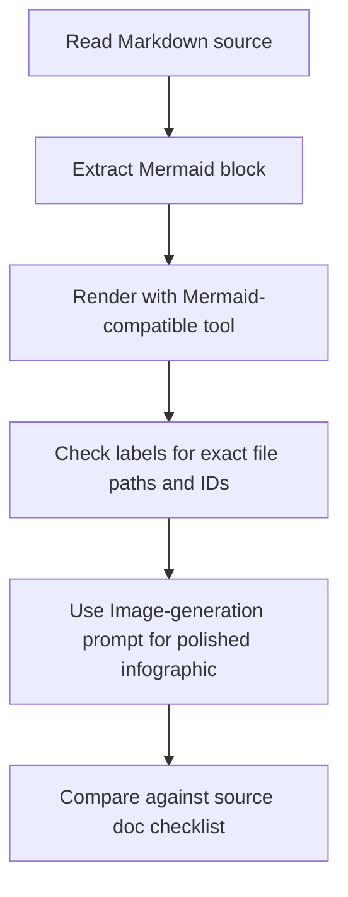

# 11. Visual Generation Guide

## 한 줄 요약

이 문서는 `presentation_source`의 Mermaid와 설명을 ChatGPT 또는 시각화 도구에 전달해 전체 프로세스 이미지를 만들 때, 생략 없이 일관된 그림 세트를 얻기 위한 제작 지시서다.

## Visual document system



Image-generation prompt:

```text
Create a master visual index for the Hazel Village GraphRAG handoff image set. Show each Markdown document from 00 to 10 as a source feeding a distinct diagram type. Use consistent colors for data, graph, runtime, quest logic, deployment, and QA.
```

## 공통 디자인 규칙

| 요소 | 권장 표현 |
|---|---|
| Canonical source | 초록색 문서/폴더 아이콘, label `rsc/data` |
| Generated output | 회색 artifact 박스, label `output/` |
| Neo4j | 파란 graph/database cylinder |
| Streamlit runtime | 보라색 app/browser panel |
| LangGraph quest runner | 주황 state machine 또는 checkpoint node |
| vLLM | 붉은 model/API 박스 |
| Admin | teal dashboard panel |
| QA | 검은색/남색 evidence checklist |
| Safety gate | 자물쇠 icon, red locked / green unlocked |
| Destructive operations | 빨간 warning triangle |

Style requirements:

- 모든 label은 문서의 실제 ID와 파일명을 유지한다.
- `rsc/data`와 `output/`을 절대 같은 source로 그리지 않는다.
- `answer_sensitive`, `allowed_hint_level`, `answer_reveal_allowed`는 안전 gate로 강조한다.
- 로완 final reveal은 최종 unlock 이벤트로 표현한다.
- Docker port는 default와 design-test를 반드시 구분한다.
- Neo4j reset/volume delete는 승인 필요 warning으로만 표현한다.

## 전체 시스템 이미지 프롬프트

Use with `01_system_architecture.md`, `03_importer_and_pipeline.md`, `04_neo4j_graph_contract.md`, `05_streamlit_runtime.md`.

```text
Create a detailed Korean technical architecture infographic for Hazel Village GraphRAG MVP.

Required nodes:
- rsc/data canonical story source
- direct importer: src/db_control/import_story_source_to_neo4j.py
- offline pipeline: scripts/story_pipeline/run_pipeline.py
- Neo4j graph: NPC, KnowledgeChunk, Quest, Clue, Truth, Event, Location, Role
- Streamlit chat runtime: src/streamlit/test_app.py
- prompt builder: src/streamlit/prompting.py
- LangGraph quest runner: quest_graph.py and quest_runtime.py
- vLLM OpenAI-compatible endpoint
- JSONL logs under output/reports
- Admin page: src/streamlit/pages/admin.py

Required flows:
1. rsc/data -> direct importer -> Neo4j -> Streamlit retrieval -> prompt -> vLLM -> NPC answer.
2. rsc/data -> offline pipeline -> output/integrated + output/neo4j_import.
3. Streamlit chat turn -> LangGraph quest decision -> retrieval gate -> prompt policy.
4. Admin page -> session memory/quest override and ConceptStory Neo4j upsert.

Warnings:
- output/ is generated, not canonical.
- Neo4j reset and volume deletion require explicit approval.
- ports are localhost-bound.

Use clean Korean labels and include code file paths below each major box.
```

## 데이터 원천 이미지 프롬프트

Use with `02_canonical_story_data.md`.

```text
Create a canonical story data infographic in Korean.

Show rsc/data as the only source of truth. Split it into:
- npcs/*.md: frontmatter, personality, speech_style, dialogue_must, dialogue_must_not, story chunks
- quests/*.yaml: quest_id, steps, required_clue_ids, answer_truth_ids, wrong_hypotheses, answer_reveal_policy, story_expansion
- world/clues.yaml: clue_id, name, hint_level, truth_ids
- world/truths.yaml: truth_id, name, required_clue_ids
- world roles/events/locations as supporting context

Show ID references:
NPC -> Quest -> Clue -> Truth.
Highlight final truth truth_moonwell_mana_cycle and final quest q_main_spore_night.

Do not show output/ as editable source.
```

## Neo4j 그래프 이미지 프롬프트

Use with `04_neo4j_graph_contract.md`.

```text
Create a Neo4j graph schema visual.

Center nodes:
- NPC
- KnowledgeChunk

Surrounding nodes:
- Quest
- Clue
- Truth
- Event
- Location
- Role
- ConceptStory as admin-only dashed node

Required relationships:
- NPC KNOWS KnowledgeChunk
- NPC HAS_ROLE Role
- NPC LOCATED_AT Location
- NPC PARTICIPATES_IN Quest
- KnowledgeChunk RELATED_TO Quest
- KnowledgeChunk MENTIONS Clue
- KnowledgeChunk ABOUT Event
- Quest REQUIRES_CLUE Clue
- Quest HAS_ANSWER Truth
- Clue POINTS_TO Truth
- Event CAUSED_BY Truth
- Event OCCURRED_AT Location

Add a side panel for KnowledgeChunk retrieval properties:
npc_id, quest_id, allowed_roles, hint_level, answer_sensitive, text.
Show gate predicates with lock icons.
```

## Runtime sequence 이미지 프롬프트

Use with `05_streamlit_runtime.md`.

```text
Create a Korean sequence diagram-style image for one chat turn.

Actors:
- Player
- Streamlit test_app.py
- st.session_state
- LangGraph quest_runtime.py
- Neo4j
- prompting.py build_prompt
- vLLM
- JSONL logs

Required sequence:
1. Player submits chat_input.
2. Streamlit appends user chat message.
3. get_npc_profile reads NPC from Neo4j.
4. run_quest_turn returns QuestDecision.
5. apply_quest_decision_to_session updates quest maps and route recommendation.
6. get_allowed_chunks retrieves gated KnowledgeChunk rows.
7. build_prompt combines NPC, chunks, memory, quest guidance, reveal flag.
8. compact memory if prompt is too large, then rebuild prompt.
9. stream_gemma_response streams vLLM tokens.
10. assistant message and per-NPC memory are saved.
11. chat log stores only input/output; retrieval/prompt/quest/memory logs are separate.

Show vLLM errors as a separate error path that does not enter chat memory.
```

## LangGraph quest 이미지 프롬프트

Use with `06_langgraph_quest_progression.md`.

```text
Create a quest progression state machine image.

Show LangGraph as START -> evaluate_quest_turn -> END with InMemorySaver checkpoint.
Show QuestGraphState fields:
npc_id, quest_id, user_message, quest_state_by_quest, observed_clue_ids_by_quest, decision.

Show state ladder:
not_started(0) -> in_progress(1) -> hint_1_given(1) -> hint_2_given(2) -> ready_to_answer(3) -> solved(3).

Show Chief Rowan final gate:
- Non-chief routes final deductions to chief_rowan.
- Chief partial routes back to missing clue NPC.
- Chief final solved only when all pre-final quests are ready and answer truth is mentioned.
- Final reveal truth: truth_moonwell_mana_cycle.

Make checkpoint thread id visible:
```

## Prompt safety 이미지 프롬프트

Use with `07_prompting_and_retrieval.md`.

```text
Create a safety-gated prompt pipeline image.

Left: current context values:
npc_id, player_role, quest_id, quest_state, allowed_hint_level, answer_reveal_allowed.

Middle: get_allowed_chunks predicates:
- NPC KNOWS chunk
- quest_id match or null
- player_role in allowed_roles
- hint_level <= allowed_hint_level
- answer_sensitive false OR reveal flag true and state ready_to_answer/solved

Right: build_prompt sections:
- NPC basic info
- personality
- speech style
- dialogue must/must_not
- current conversation conditions
- previous memory
- quest guidance
- final reveal instruction when allowed
- available knowledge
- response policy
- player question

Show final answer reveal as locked unless quest rules, retrieval, and prompt policy all unlock.
```

## Admin 이미지 프롬프트

Use with `08_admin_ui.md`.

```text
Create an Admin UI visual for src/streamlit/pages/admin.py.

Show three tabs:
1. Memory Admin: NPC Memory Target, Max Memory Count, Save Memory Setting, Clear selected NPC memory, Current Summary. Label storage as session_state only.
2. Quest Admin: Quest selectbox, Quest State selectbox, Allowed Hint Level metric/progress, Save Quest State. Show hint level derived from QUEST_STATE_HINT_LEVELS, no manual slider.
3. Concept Story Admin: lookup form, import form, validation, MERGE ConceptStory node in Neo4j.

Show logs:
- memory JSONL
- admin JSONL
- neo4j_import JSONL

Make clear that ConceptStory is not currently part of normal NPC retrieval.
```

## Docker 이미지 프롬프트

Use with `09_docker_and_deployment.md`.

```text
Create a side-by-side Docker deployment comparison.

Left: default compose.yaml
- Streamlit 127.0.0.1:8501
- Neo4j 127.0.0.1:7474 and 7687
- vLLM 127.0.0.1:8000 under gpu profile
- model google/gemma-4-E4B-it
- volume hazel_neo4j_data

Right: compose.design-test.yaml
- project name hazel_design_test
- Streamlit 127.0.0.1:18501
- Neo4j 127.0.0.1:17474 and 17687
- vLLM 127.0.0.1:18000 under gpu profile
- model google/gemma-4-E2B-it
- volume hazel_design_test_neo4j_data

Bottom: Dockerfile uses uv python3.10, uv sync --frozen --no-dev, runs streamlit src/streamlit/test_app.py.

Add security note: ports are localhost-bound; use SSH tunnel or reverse proxy for external access.
```

## QA 이미지 프롬프트

Use with `10_qa_and_test_artifacts.md`.

```text
Create a QA evidence map.

Group tests:
- test_streamlit_prompting.py: prompt sections, memory, final reveal instruction, hidden metadata
- test_streamlit_contract.py: retrieval gate, logs, admin page, Docker compose, vLLM error handling
- test_quest_auto_progression.py: clue unlock, routes, final solve, checkpoint continuity/isolation
- test_quest_conversation_contract.py: multi-quest route chain, Rowan partial/final, chat log contract
- run_quest_scenario_quality.py: live Neo4j + E2B vLLM 11-turn QA

Show generated artifacts:
- output/reports/quest_scenario_quality_20260630.json
- output/reports/quest_scenario_quality_20260630.md
- docs/npc_persona_version_2/quest_scenario_qa_log_20260630.md

Emphasize PASS, 11 turns, 30 KnowledgeChunks, model google/gemma-4-E2B-it.
```

## Mermaid rendering guidance



Image-generation prompt:

```text
Create a workflow image showing how to transform these Markdown source docs into final visuals: read source, render Mermaid, verify exact labels, use the prompt block for polished image generation, then compare back to the checklist.
```

Mermaid rules:

- Keep node names short in Mermaid.
- Put long explanations outside the diagram in prose.
- If a diagram gets crowded, split it by document rather than shrinking text.
- Preserve exact code identifiers in monospace when the rendering tool supports it.
- Use dashed edges for admin-only or optional flows.
- Use red warning style for reset/destructive operations.

## Coverage checklist for generated images

Before accepting generated visuals, confirm every item appears somewhere in the image set:

- [ ] `rsc/data` is canonical story source.
- [ ] `output/` is generated artifact/evidence, not source of truth.
- [ ] Direct importer and offline pipeline are separate paths.
- [ ] Neo4j central runtime nodes include `NPC` and `KnowledgeChunk`.
- [ ] Retrieval gate includes role, quest, hint level, answer-sensitive conditions.
- [ ] Streamlit chat turn includes LangGraph before retrieval and prompt before vLLM.
- [ ] Per-NPC memory is session-only.
- [ ] Chat log contains only `input` and `output`.
- [ ] LangGraph is a deterministic `StateGraph` with `InMemorySaver`, not an autonomous agent.
- [ ] Chief Rowan final reveal requires all pre-final quests and correct final deduction.
- [ ] Admin has Memory, Quest, ConceptStory tabs.
- [ ] ConceptStory is admin-only and not normal retrieval context.
- [ ] Default compose uses E4B and ports 8501/8000/7474/7687.
- [ ] Design-test compose uses E2B and ports 18501/18000/17474/17687.
- [ ] QA live scenario has 11 turns, 30 chunks, PASS.
- [ ] Neo4j reset/volume deletion are marked as approval-required.

## 인수인계 포인트

- 이미지를 한 장으로 압축하려고 하지 말고 기능별 여러 장으로 만든다.
- 각 문서의 Mermaid는 구조 정확도용이고, `Image-generation prompt`는 발표용 시각 품질 향상용이다.
- 이미지 생성 모델이 내용을 생략하면 이 문서의 coverage checklist를 근거로 재생성한다.
- 영어 label과 한국어 설명을 섞어도 되지만, code path와 ID는 정확히 유지한다.
- 최종 발표 자료에서는 `00_index.md`의 읽는 순서를 그대로 따른다.
